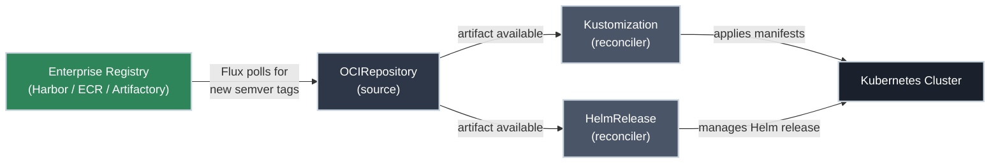

# Flux Resources: What You'll See in the Cluster

!!! tip "Part of Day One: Understanding GitOps"
    This article follows [Reading Flux Status](reading_flux_status.md). You've run `kubectl get` commands and seen resources like `OCIRepository` and `Kustomization` — this explains what they actually are.

When you run [`kubectl get`](https://k8s.bradpenney.io/day_one/kubectl/commands/) in a Flux-managed cluster, you'll see resource types that don't exist in a standard Kubernetes installation. These are Flux's custom resources — each one is a declaration of something Flux should be doing continuously.

!!! info "What You'll Learn"
    - The two categories of Flux resources: sources and reconcilers
    - What `OCIRepository`, `Kustomization`, `HelmRelease`, and `GitRepository` are
    - How to read their output at a glance
    - Which ones are relevant to your application

---

## Sources and Reconcilers

Flux resources fall into two categories:

<div class="grid cards" markdown>

-   :material-download: **Sources**

    ---

    A source tells Flux *where* to fetch content from. It continuously watches an external location — an artifact registry or a Git repository — and makes the content available to reconcilers.

    **Source types:** `OCIRepository`, `GitRepository`, `HelmRepository`, `Bucket`

-   :material-sync: **Reconcilers**

    ---

    A reconciler tells Flux *what to do* with a source. It takes the content from a source and continuously applies it to the cluster, correcting drift whenever it detects a difference.

    **Reconciler types:** `Kustomization`, `HelmRelease`

</div>

The chain is always: **source fetches content → reconciler applies it to the cluster.**

---

## OCIRepository

An `OCIRepository` is a Flux source that watches an OCI-compliant artifact registry — [Harbor](https://goharbor.io/), AWS ECR, [JFrog Artifactory](https://jfrog.com/artifactory/) — for new versions of a versioned artifact. In an enterprise GitOps setup, this is the primary source for application deployments.

You may well write one of these yourself — they live in your GitOps config repo. Authoring it isn't the restricted part; *deploying* it to production is, and that takes someone with the right permission (the SRE). Here's what one looks like:

```yaml title="An OCIRepository (you write it; an SRE deploys it)" linenums="1"
apiVersion: source.toolkit.fluxcd.io/v1beta2
kind: OCIRepository
metadata:
  name: my-app
  namespace: flux-system
spec:
  interval: 5m  # (1)!
  url: oci://registry.company.com/my-app-config  # (2)!
  ref:
    semver: ">=1.2.0"  # (3)!
```

1.  How often Flux polls the registry for new tags.
2.  The artifact repository Flux watches.
3.  A semver *range* — dev and staging follow the newest match; production pins an exact tag instead.

When your CI pipeline builds and pushes `registry/my-app-config:v1.2.3`, what happens next depends on *how* the `OCIRepository` references its tag:

- **Following a semver range** (e.g. `>=1.2.0`) — the `OCIRepository` detects the new tag, selects the newest version that matches, and makes it available to the `Kustomization` or `HelmRelease` that references it. New artifacts are pulled in **automatically** — convenient for dev and staging.
- **Pinned to an exact version** (e.g. `v1.2.3`) — Flux fetches only that version and ignores anything newer until someone changes the pin. Nothing moves on its own.

**Production should be pinned.** With a pinned `OCIRepository`, a newly pushed artifact sits in the registry — available but *not* deployed — until a deliberate change advances the version. That controlled promotion is what production demands; an unpinned range would let prod drift onto whatever was pushed last. See [Your Flux Workflow](your_flux_workflow.md) for how that promotion is handled.

```bash title="Check OCIRepository status"
kubectl get ocirepository -n flux-system
# NAME       READY   STATUS                                          AGE
# my-app     True    stored artifact for digest: sha256:abc123...   2d
```

```bash title="Get full detail"
kubectl describe ocirepository my-app -n flux-system
```

The `Conditions` section tells you the last fetch time and any errors. If `READY: False`, the `Message` field says why.

---

## Kustomization

A `Kustomization` is a Flux reconciler that takes content from a source (usually an `OCIRepository`) and applies the Kubernetes manifests inside it to the cluster. It runs on an interval — typically every few minutes — comparing the cluster's actual state to the manifests and correcting any differences.

Most applications have one `Kustomization` per environment (or per app). Your platform team controls how they're organised.

Same story — yours to write, the SRE's to deploy:

```yaml title="A Kustomization (you write it; an SRE deploys it)" linenums="1"
apiVersion: kustomize.toolkit.fluxcd.io/v1
kind: Kustomization
metadata:
  name: my-app
  namespace: flux-system
spec:
  interval: 10m  # (1)!
  sourceRef:
    kind: OCIRepository  # (2)!
    name: my-app
  path: ./deploy/production  # (3)!
  prune: true  # (4)!
```

1.  How often Flux re-checks the cluster against the manifests.
2.  Where the manifests come from — the `OCIRepository` source above.
3.  Which directory inside the artifact to apply.
4.  Delete cluster resources that were removed from Git.

```bash title="Check Kustomization status"
kubectl get kustomization -n flux-system
# NAME              READY   STATUS                                 AGE
# my-app            True    Applied revision: v1.2.3@sha256:abc   2d
# infrastructure    True    Applied revision: v3.0.1@sha256:def   5d
```

```bash title="Get full detail when READY is False"
kubectl describe kustomization my-app -n flux-system
```

The `Message` field in `Conditions` contains the Kubernetes error — usually a YAML validation failure, a missing resource reference, or an invalid field value.

---

## HelmRelease

A `HelmRelease` is a Flux reconciler that manages a [Helm](https://k8s.bradpenney.io/day_one/helm/commands/) release declaratively. Instead of running `helm upgrade` manually, a `HelmRelease` resource declares the chart, version, and values — and Flux keeps the release reconciled to that declaration continuously.

If your application is deployed as a Helm chart, this is what Flux uses instead of (or alongside) a `Kustomization`.

Likewise authored by you, deployed by the SRE:

```yaml title="A HelmRelease (you write it; an SRE deploys it)" linenums="1"
apiVersion: helm.toolkit.fluxcd.io/v2
kind: HelmRelease
metadata:
  name: my-app
  namespace: my-app
spec:
  interval: 10m
  chartRef:
    kind: OCIRepository  # (1)!
    name: my-app
  values:  # (2)!
    replicaCount: 3
```

1.  The chart, delivered as an OCI artifact.
2.  The same settings you'd otherwise put in `values.yaml`.

```bash title="Check HelmRelease status"
kubectl get helmrelease -n <your-app-namespace>
# NAME     READY   STATUS               AGE
# my-app   True    Release reconciled   3h
```

```bash title="Get full detail"
kubectl describe helmrelease my-app -n <your-app-namespace>
```

Common failure causes: chart not found, values validation errors, or a Helm hook that failed.

---

## GitRepository

Flux can also watch a Git repository directly via a `GitRepository` source. You may see one in a cluster, but this site delivers everything — applications *and* infrastructure — as versioned OCI artifacts, and doesn't recommend Git-forge watching for delivery. [Your Flux Workflow](your_flux_workflow.md) explains the reasoning.

---

## The Full Picture

Here's how these resources connect for a typical application deployment:



---

## Quick Recap

| Resource | Type | What It Does |
|----------|------|-------------|
| `OCIRepository` | Source | Watches an artifact registry for new semver-tagged artifacts |
| `Kustomization` | Reconciler | Applies Kubernetes manifests from a source to the cluster |
| `HelmRelease` | Reconciler | Manages a Helm release declaratively from a source |

| Command | What You'll Learn |
|---------|------------------|
| `kubectl get ocirepository -n flux-system` | Is Flux fetching my app's artifact? |
| `kubectl get kustomization -n flux-system` | Are my manifests applied? |
| `kubectl get helmrelease -n <namespace>` | Is my Helm release reconciling? |
| `kubectl describe <resource> <name> -n <namespace>` | Why is something `READY: False`? |

---

## What's Next

You've completed Day One. You understand the GitOps paradigm, your role as a developer in the pipeline, how to verify your changes landed, and what the Flux resources in your cluster are doing.

**Responsible for setting up or managing Flux?** That's the Essentials section — installing Flux, configuring `OCIRepository` sources, managing secrets, and wiring up your CI pipeline.

---

## Further Reading

### Official Documentation

- [FluxCD: OCIRepository](https://fluxcd.io/flux/components/source/ocirepositories/) — full spec and authentication options
- [FluxCD: Kustomization](https://fluxcd.io/flux/components/kustomize/) — reconciler configuration reference
- [FluxCD: HelmRelease](https://fluxcd.io/flux/components/helm/) — Helm release management with Flux

### Related Learning

- [Essential kubectl Commands](https://k8s.bradpenney.io/day_one/kubectl/commands/) — the `get` and `describe` commands used throughout this article
- [Helm Commands](https://k8s.bradpenney.io/day_one/helm/commands/) — Helm basics for understanding HelmRelease

### Related Articles

- [Reading Flux Status](reading_flux_status.md) — using these resources to verify your deployment
- [Your Flux Workflow](your_flux_workflow.md) — how changes flow from your code to these resources
- [What Is GitOps?](what_is_gitops.md) — the paradigm behind all of this
- [Day One Overview](overview.md) — the full Day One learning path
