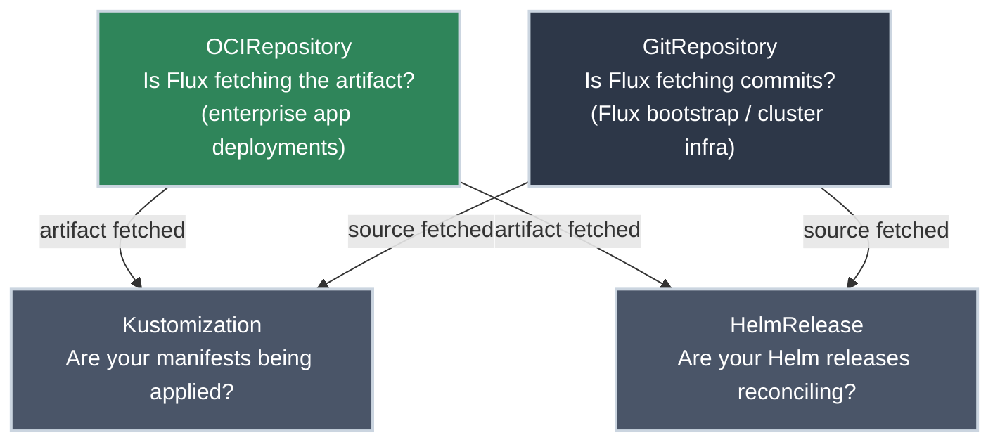

# Reading Flux Status

!!! tip "Part of Day One: Understanding GitOps"
    This article follows [Your Flux Workflow](your_flux_workflow.md). You've merged a PR — now you need to know if Flux picked it up and applied it.

You merged the PR ten minutes ago. The cluster should be running your new version, but you're not certain. You need to know: **did Flux reconcile, and did it succeed?**

Flux surfaces its status on its source resources (`OCIRepository` or `GitRepository`), its reconciler resources (`Kustomization`, `HelmRelease`), and that whole chain has to be healthy for your change to be live. You check them with [`kubectl`](https://k8s.bradpenney.io/day_one/kubectl/commands/) — the same tool you've been using for everything else in the cluster.

!!! info "What You'll Learn"
    - The Flux resources to check and what each one tells you
    - The `kubectl` commands to inspect reconciliation status
    - How to read status conditions and interpret errors
    - The most common failure patterns and what causes them

---

## The Resources to Check



- **[`OCIRepository`](https://fluxcd.io/flux/components/source/ocirepositories/)** — the enterprise source type. Tells you whether Flux can reach your artifact registry and is fetching the correct versioned artifact. **Check this first for app deployments.**
- **[`GitRepository`](https://fluxcd.io/flux/components/source/)** — used for Flux's own bootstrap config and cluster infrastructure. If this isn't healthy, Flux itself may not reconcile.
- **[`Kustomization`](https://fluxcd.io/flux/components/kustomize/)** — tells you whether your plain YAML or Kustomize manifests have been applied to the cluster.
- **[`HelmRelease`](https://fluxcd.io/flux/components/helm/)** — tells you whether a Helm release has been installed or upgraded successfully.

Your platform team controls which sources and reconcilers are set up — you may have one `Kustomization` per app or one per environment. Ask them which resources correspond to your application.

---

## Checking Status

These commands cover the majority of what you'll need day-to-day. Flux resources typically live in the `flux-system` namespace.

<div class="grid cards" markdown>

-   :material-package-registry: **OCIRepository Status**

    ---

    **Why it matters:** In enterprise GitOps, `OCIRepository` is the source Flux uses for application deployments. If Flux can't reach the artifact registry or isn't finding the expected semver version, app deployments won't reconcile. **Check this first.**

    ```bash title="Check OCIRepository status"
    kubectl get ocirepository -n flux-system
    # NAME       READY   STATUS                                        AGE
    # my-app     True    stored artifact for digest: sha256:abc123     2d
    #            ...     latest semver tag: v2.1.0
    ```

    **What to look for:** `READY: True` and a version matching what CI just pushed (`v2.1.0`). If `READY: False`, Flux can't reach the registry or no artifact satisfies the semver policy — a platform team call.

-   :material-source-branch: **GitRepository Status**

    ---

    **Why it matters:** `GitRepository` sources are used for Flux's own bootstrap config and cluster infrastructure. If this isn't healthy, Flux itself may have trouble reconciling infrastructure changes. Less relevant for your day-to-day app deployments.

    ```bash title="Check GitRepository status"
    kubectl get gitrepository -n flux-system
    # NAME          READY   STATUS                               AGE
    # flux-system   True    stored artifact for                  2d
    #                       revision: main@sha1:abc123def456
    ```

    **What to look for:** `READY: True` and a revision matching the expected commit. If `READY: False`, Flux can't reach the repo — usually an auth problem or a network issue. That's a platform team call, not yours.

-   :material-file-code: **Kustomization Status**

    ---

    **Why it matters:** This tells you whether your YAML manifests have been applied to the cluster and whether they're in sync with Git.

    ```bash title="Check Kustomization status"
    kubectl get kustomization -n flux-system
    # NAME              READY   STATUS                              AGE
    # apps              True    Applied revision: main@sha1:abc     2d
    # infrastructure    True    Applied revision: main@sha1:abc     2d
    ```

    **What to look for:** `READY: True` and an `Applied revision` that matches your commit hash. `READY: False` means something in the manifests failed to apply.

-   :material-package-variant: **HelmRelease Status**

    ---

    **Why it matters:** If your app is deployed as a Helm chart, this is where you check whether the release succeeded.

    ```bash title="Check HelmRelease status"
    kubectl get helmrelease -n <your-app-namespace>
    # NAME     READY   STATUS              AGE
    # my-app   True    Release reconciled  3h
    ```

    **What to look for:** `READY: True` and `Release reconciled`. A failed upgrade or install shows as `False`.

</div>

---

## Getting More Detail

`kubectl get` shows you a summary. When something is `READY: False` — or you want to understand the full error — use `kubectl describe`:

```bash title="Describe a Kustomization for details"
kubectl describe kustomization apps -n flux-system
```

The important section is **Conditions** near the bottom of the output.

**When reconciliation succeeded:**

```bash title="Conditions output — healthy"
Conditions:
  Last Transition Time:   2026-06-08T14:30:00Z
  Message:                Applied revision: main@sha1:abc123def456
  Reason:                 ReconciliationSucceeded
  Status:                 True
  Type:                   Ready
```

**When reconciliation failed:**

```bash title="Conditions output — error"
Conditions:
  Last Transition Time:   2026-06-08T14:35:00Z
  Message:                Service "my-app" is invalid: spec.ports[0].targetPort:
                          Invalid value: "web": named port not found
  Reason:                 ReconciliationFailed
  Status:                 False
  Type:                   Ready
```

The `Message` field is where the actual error lives. In this example, a Service manifest references a named port (`web`) that doesn't exist in the corresponding Pod spec — a YAML error that went unnoticed until Flux tried to apply it.

---

## Common Scenarios

=== ":material-check-circle: Everything Is Healthy"

    **What you see:**

    ```bash title="All resources ready"
    kubectl get gitrepository,kustomization -n flux-system
    # NAME                              READY   STATUS
    # gitrepository/flux-system         True    stored artifact for revision: main@sha1:abc123
    # kustomization/apps                True    Applied revision: main@sha1:abc123
    # kustomization/infrastructure      True    Applied revision: main@sha1:abc123
    ```

    **What it means:** Flux fetched your commit and applied the manifests. Your change is live. Verify by checking the actual Kubernetes resource directly:

    ```bash title="Verify the Deployment updated"
    kubectl get deployment my-app -n production
    # NAME     READY   UP-TO-DATE   AVAILABLE   AGE
    # my-app   3/3     3            3           14d

    kubectl describe deployment my-app -n production | grep Image
    # Image:  registry.company.com/my-app:v2.1.0   ← Your new version
    ```

=== ":material-clock-outline: Pending — Not Reconciled Yet"

    **What you see:**

    ```bash title="Status still shows old revision"
    kubectl get kustomization apps -n flux-system
    # NAME   READY   STATUS                              AGE
    # apps   True    Applied revision: main@sha1:old123
    ```

    The status shows your *previous* commit hash, not your latest one.

    **What it means:** Flux hasn't polled since your merge. The default interval is 1-5 minutes. Wait and check again. If it hasn't updated after 10 minutes, check the `GitRepository` status — Flux may not be reaching your repo.

=== ":material-alert: Reconciliation Failed"

    **What you see:**

    ```bash title="Kustomization in failed state"
    kubectl get kustomization apps -n flux-system
    # NAME   READY   STATUS                    AGE
    # apps   False   kustomize build failed:   2d
    #                ...
    ```

    **What to do:**

    ```bash title="Get the full error"
    kubectl describe kustomization apps -n flux-system
    # Look for the Message field in the Conditions section
    ```

    Read the `Message` field. Common causes:

    - **YAML syntax error** — a malformed manifest in your PR
    - **Missing resource** — a reference to a ConfigMap, Secret, or other resource that doesn't exist
    - **Invalid field value** — a field value that Kubernetes rejects (wrong type, invalid name, etc.)

    The fix: find the error in your manifests, correct the YAML, open a PR.

=== ":material-package-registry: OCIRepository Not Ready"

    **What you see:**

    ```bash title="OCIRepository not fetching"
    kubectl get ocirepository -n flux-system
    # NAME     READY   STATUS                                  AGE
    # my-app   False   failed to fetch artifact...             2d
    ```

    **What it means:** Flux cannot reach your artifact registry or cannot find an artifact that satisfies the semver policy. Common causes:

    - Registry credentials expired (a platform team problem — they rotate secrets)
    - No artifact tagged with a version satisfying the constraint (e.g., no `v2.x.x` exists yet — CI may not have pushed successfully)
    - Network policy blocking Flux from reaching the registry

    Run `kubectl describe ocirepository my-app -n flux-system` and read the `Message` field to identify which case it is. If it's a credentials or network issue, hand it to the platform team. If CI failed to push, check your CI pipeline.

=== ":material-git: GitRepository Not Ready"

    **What you see:**

    ```bash title="GitRepository not fetching"
    kubectl get gitrepository -n flux-system
    # NAME          READY   STATUS                                  AGE
    # flux-system   False   failed to checkout and determine...     2d
    ```

    **What it means:** Flux cannot reach or authenticate to your Git repo. This `GitRepository` resource is typically used for Flux's own cluster-bootstrap config — not your app. This is almost always a platform team problem — an SSH key expired, a token was rotated, or a network policy changed.

    Run `kubectl describe gitrepository flux-system -n flux-system` and note the full error message to help them diagnose it. Then hand it off — this isn't something a Day One developer fixes.

---

## Practice Exercises

??? question "Exercise 1: Read the Status"
    You run `kubectl get kustomization -n flux-system` and see:

    ```
    NAME    READY   STATUS                    AGE
    apps    False   Service "api" not found   2d
    ```

    Your PR yesterday updated the image tag for the `api` Deployment. **What's the likely cause, and what do you do?**

    ??? tip "Solution"
        The error `Service "api" not found` suggests a manifest in your PR references a Service named `api` that doesn't exist in the cluster.

        **Likely cause:** Your PR either:

        - Changed a resource that depends on a Service that wasn't created yet
        - Contains a typo in a service name
        - Added a resource before its dependency (the Service) was applied

        **What to do:**

        1. Run `kubectl describe kustomization apps -n flux-system` for the full error message
        2. Check your PR diff — what changed, and does any manifest reference a Service named `api`?
        3. Fix the YAML, open a new PR

??? question "Exercise 2: Is My Change Live?"
    You merged a PR 3 minutes ago that updated `my-app` from `v1.5.0` to `v1.6.0`. You run:

    ```
    kubectl get kustomization apps -n flux-system
    NAME   READY   STATUS                              AGE
    apps   True    Applied revision: main@sha1:abc789
    ```

    You check your repo and your commit hash is `def456`. **Has your change applied?**

    ??? tip "Solution"
        **Not yet.** The revision `abc789` in the Flux status is the commit *before* yours (`def456`). Flux hasn't polled since your merge.

        Wait another minute or two and check again. If Flux polls successfully, the status will update to show `def456` and `READY: True`.

        If it still shows the old revision after 5-10 minutes, check the `GitRepository` status — Flux may not be fetching new commits.

??? question "Exercise 3: Where's the Error?"
    `kubectl get kustomization apps -n flux-system` shows `READY: False`. What's your next command, and what part of the output do you read?

    ??? tip "Solution"
        ```bash title="Get the full error detail"
        kubectl describe kustomization apps -n flux-system
        ```

        Look for the **Conditions** section near the bottom. The `Message` field contains the actual error — a failed validation, a Kubernetes API rejection, or a missing resource.

        `kubectl get` gives you the summary. `kubectl describe` gives you the why.

---

## Quick Recap

| Resource | Namespace | What It Tells You |
|----------|-----------|------------------|
| `OCIRepository` | `flux-system` | Is Flux fetching the versioned artifact from the registry? |
| `GitRepository` | `flux-system` | Is Flux fetching Flux's own bootstrap config from Git? |
| `Kustomization` | `flux-system` | Are manifests being applied? |
| `HelmRelease` | your app's namespace | Is the Helm release reconciling? |

| Command | When to Use |
|---------|------------|
| `kubectl get ocirepository -n flux-system` | First check — is Flux fetching my app's artifact? |
| `kubectl get kustomization -n flux-system` | Are manifests being applied from the artifact? |
| `kubectl describe kustomization <name> -n flux-system` | Full error message when READY is False |
| `kubectl get gitrepository -n flux-system` | When Flux's cluster-bootstrap config isn't reconciling |
| `kubectl get helmrelease -n <namespace>` | For Helm-deployed apps |

---

## You've Completed Day One

You understand:

- **What GitOps is** — Git as the source of truth, continuous reconciliation
- **What FluxCD is** — the controller that implements GitOps for Kubernetes
- **Your workflow** — commit your code, CI builds the versioned OCI artifact, Flux applies it
- **How to check status** — whether your changes actually applied

If you're responsible for *setting up* or *managing* Flux — installing it, configuring `OCIRepository` sources, managing secrets — that's the **Essentials** section. That's platform engineer territory.

---

## Further Reading

### Official Documentation

- [FluxCD: Troubleshooting Cheatsheet](https://fluxcd.io/flux/cheatsheets/troubleshooting/) — the Flux troubleshooting reference
- [FluxCD: Monitoring](https://fluxcd.io/flux/monitoring/) — metrics, dashboards, and alerts for Flux

### Related Learning

- [Essential kubectl Commands](https://k8s.bradpenney.io/day_one/kubectl/commands/) — The full reference for `kubectl get` and `kubectl describe` used throughout this article
- [Your First Deployment](https://k8s.bradpenney.io/day_one/kubectl/first_deploy/) — The manual deployment approach that GitOps replaces

### Related Articles

- [Your Flux Workflow](your_flux_workflow.md) — making changes through GitOps
- [What Is GitOps?](what_is_gitops.md) — the paradigm behind what you just learned
- [Day One Overview](overview.md) — the full Day One learning path
