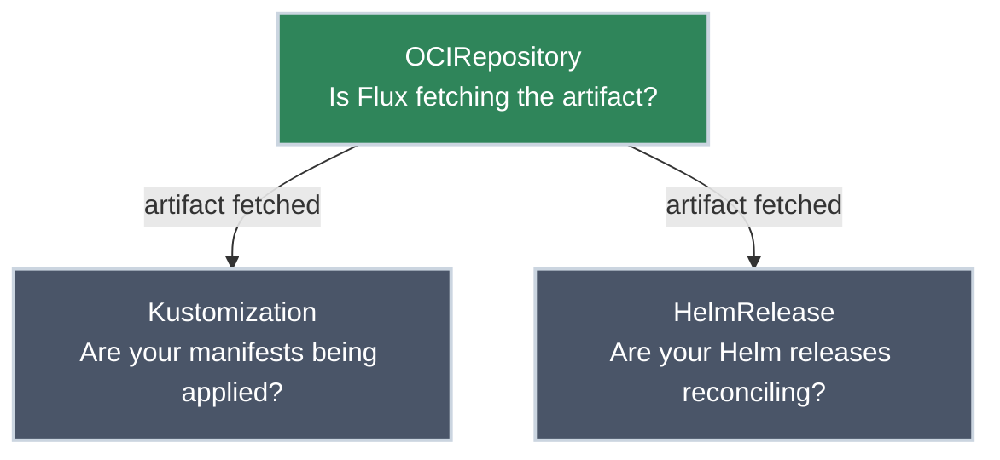

# Reading Flux Status

!!! tip "Part of Day One: Understanding GitOps"
    This article follows [Your Flux Workflow](your_flux_workflow.md). You've merged a PR and it's been released as a new artifact — now you need to know if Flux picked it up and applied it.

You merged the PR, a release was cut, and CI pushed a new artifact ten minutes ago. In **dev or staging**, where Flux tracks a semver range, the cluster should now be running it automatically. **Production is different** — it pins a specific version and only moves when someone promotes it, so a fresh artifact won't deploy there on its own. Either way, the question is the same: **did Flux reconcile the artifact it's tracking, and did it succeed?**

Flux surfaces its status on its source resource (the `OCIRepository`) and its reconciler resources (`Kustomization`, `HelmRelease`), and that whole chain has to be healthy for your change to be live. You check them with [`kubectl`](https://k8s.bradpenney.io/day_one/kubectl/commands/) — the same tool you've been using for everything else in the cluster.

!!! info "What You'll Learn"
    - The Flux resources to check and what each one tells you
    - The `kubectl` commands to inspect reconciliation status
    - How to read status conditions and interpret errors
    - The most common failure patterns and what causes them

---

## The Resources to Check



- **[`OCIRepository`](https://fluxcd.io/flux/components/source/ocirepositories/)** — the source Flux uses for everything on this site. Tells you whether Flux can reach your artifact registry and is fetching the correct versioned artifact. **Check this first.**
- **[`Kustomization`](https://fluxcd.io/flux/components/kustomize/)** — tells you whether your plain YAML or Kustomize manifests have been applied to the cluster.
- **[`HelmRelease`](https://fluxcd.io/flux/components/helm/)** — tells you whether a Helm release has been installed or upgraded successfully.

Your platform team controls which sources and reconcilers are set up — you may have one `Kustomization` per app or one per environment. Ask them which resources correspond to your application.

!!! note "What about `GitRepository`?"
    Flux can also watch a Git repository directly via a `GitRepository` source. You may see one in a cluster, but this site delivers everything — apps *and* infrastructure — as OCI artifacts, and doesn't recommend Git-forge watching for delivery. [Your Flux Workflow](your_flux_workflow.md) explains why.

---

## Checking Status

These commands cover the majority of what you'll need day-to-day. Flux resources typically live in the `flux-system` namespace.

!!! tip "Friendlier tools than raw `kubectl`"
    Everything below uses `kubectl` because it's always present. Two tools make Flux status easier to read if you have them:

    - The [`flux` CLI](https://fluxcd.io/flux/cmd/) — `flux get kustomizations`, `flux get sources oci`, and `flux reconcile` give you the same information (and a manual sync) with friendlier output.
    - [**flux9s**](https://flux9s.ca/) — a [k9s](https://k9scli.io/)-inspired terminal UI that watches your Flux resources live: reconciliation state, YAML, ownership traces, and history, all navigable with k9s-style keystrokes. If you live in the terminal and want an at-a-glance answer to "did my change land?", it's worth installing ([source](https://github.com/dgunzy/flux9s), Rust, Apache-2.0).

    Use whichever you have — `kubectl` always works.

!!! note "You May Not Have Access"
    Your platform team may use standard Kubernetes RBAC to limit who can read Flux resources — especially in the `flux-system` namespace. If a `kubectl get` here returns a `Forbidden` error, that's expected, not broken: ask your platform team for read access, or for the namespace where your app's resources live.

<div class="grid cards single-col" markdown>

-   :material-cube-outline: **OCIRepository Status**

    ---

    **Why it matters:** In enterprise GitOps, `OCIRepository` is the source Flux uses for application deployments. If Flux can't reach the artifact registry or isn't finding the expected semver version, app deployments won't reconcile. **Check this first.**

    ```bash title="Check OCIRepository status"
    kubectl get ocirepository -n flux-system
    # NAME       READY   STATUS                                        AGE
    # my-app     True    stored artifact for digest: sha256:abc123     2d
    #            ...     latest semver tag: v2.1.0
    ```

    **What to look for:** `READY: True` and a version matching what CI just pushed (`v2.1.0`). If `READY: False`, Flux can't reach the registry or no artifact satisfies the semver policy — a platform team call.

-   :material-file-code: **Kustomization Status**

    ---

    **Why it matters:** This tells you whether your manifests have been applied to the cluster and whether they're in sync with the source Flux is tracking.

    ```bash title="Check Kustomization status"
    kubectl get kustomization -n flux-system
    # NAME              READY   STATUS                                       AGE
    # apps              True    Applied revision: v2.1.0@sha256:abc123       2d
    # infrastructure    True    Applied revision: v3.0.1@sha256:def456       5d
    ```

    **What to look for:** `READY: True` and an `Applied revision` whose tag matches the artifact version you released (`v2.1.0`). `READY: False` means something failed to apply.

-   :material-package-variant: **HelmRelease Status**

    ---

    **Why it matters:** If your app is deployed as a Helm chart, this is where you check whether the release succeeded.

    ```bash title="Check HelmRelease status"
    kubectl get helmrelease -n <your-app-namespace>
    # NAME     READY   STATUS              AGE
    # my-app   True    Release reconciled  3h
    ```

    **What to look for:** `READY: True` and `Release reconciled`. A failed upgrade or install shows as `False`.

</div>

---

## Getting More Detail

`kubectl get` shows you a summary. When something is `READY: False` — or you want to understand the full error — use `kubectl describe`:

```bash title="Describe a Kustomization for details"
kubectl describe kustomization apps -n flux-system
```

The important section is **Conditions** near the bottom of the output.

**When reconciliation succeeded:**

```bash title="Conditions output — healthy"
Conditions:
  Last Transition Time:   2026-06-08T14:30:00Z
  Message:                Applied revision: v2.1.0@sha256:abc123def456
  Reason:                 ReconciliationSucceeded
  Status:                 True
  Type:                   Ready
```

**When reconciliation failed:**

```bash title="Conditions output — error"
Conditions:
  Last Transition Time:   2026-06-08T14:35:00Z
  Message:                Service "my-app" is invalid: spec.ports[0].targetPort:
                          Invalid value: "web": named port not found
  Reason:                 ReconciliationFailed
  Status:                 False
  Type:                   Ready
```

The `Message` field is where the actual error lives. In this example, a Service manifest references a named port (`web`) that doesn't exist in the corresponding Pod spec — a YAML error that went unnoticed until Flux tried to apply it.

---

## Common Scenarios

=== ":material-check-circle: Everything Is Healthy"

    **What you see:**

    ```bash title="All resources ready"
    kubectl get ocirepository,kustomization -n flux-system
    # NAME                              READY   STATUS
    # ocirepository/my-app              True    stored artifact for v2.1.0
    # kustomization/apps                True    Applied revision: v2.1.0@sha256:abc123
    # kustomization/infrastructure      True    Applied revision: v3.0.1@sha256:def456
    ```

    **What it means:** Flux fetched the artifact and applied the manifests. Your change is live. Verify by checking the actual Kubernetes resource directly:

    ```bash title="Verify the Deployment updated"
    kubectl get deployment my-app -n production
    # NAME     READY   UP-TO-DATE   AVAILABLE   AGE
    # my-app   3/3     3            3           14d

    kubectl describe deployment my-app -n production | grep Image
    # Image:  registry.company.com/my-app:v4.7.0   ← image declared by artifact v2.1.0
    ```

=== ":material-clock-outline: Pending — Not Reconciled Yet"

    **What you see:**

    ```bash title="Reconciliation still in progress"
    kubectl get kustomization apps -n flux-system
    # NAME   READY     STATUS                       AGE
    # apps   Unknown   Reconciliation in progress   2d
    ```

    `READY: Unknown` means Flux is mid-reconcile — fetching or applying the new artifact. (If instead it shows `READY: True` but the `Applied revision` is still your *previous* version, Flux simply hasn't polled the registry yet — there, the revision, not `READY`, is the tell.)

    **What it means:** give it time. The default poll interval is 1-5 minutes. Wait and check again — or, if you can't wait, your platform team can force an immediate sync with `flux reconcile source oci my-app` rather than waiting for the next poll. If it's still not done after 10 minutes, check the `OCIRepository` status — Flux may not be reaching the registry.

=== ":material-alert: Reconciliation Failed"

    **What you see:**

    ```bash title="Kustomization in failed state"
    kubectl get kustomization apps -n flux-system
    # NAME   READY   STATUS                    AGE
    # apps   False   kustomize build failed:   2d
    #                ...
    ```

    **What to do:**

    ```bash title="Get the full error"
    kubectl describe kustomization apps -n flux-system
    # Look for the Message field in the Conditions section
    ```

    Read the `Message` field. Common causes:

    - **YAML syntax error** — a malformed manifest in your PR
    - **Missing resource** — a reference to a ConfigMap, Secret, or other resource that doesn't exist
    - **Invalid field value** — a field value that Kubernetes rejects (wrong type, invalid name, etc.)

    The fix: find the error in your manifests, correct the YAML, open a PR.

=== ":material-cube-outline: OCIRepository Not Ready"

    **What you see:**

    ```bash title="OCIRepository not fetching"
    kubectl get ocirepository -n flux-system
    # NAME     READY   STATUS                                  AGE
    # my-app   False   failed to fetch artifact...             2d
    ```

    **What it means:** Flux cannot reach your artifact registry or cannot find an artifact that satisfies the semver policy. Common causes:

    - Registry credentials expired (a platform team problem — they rotate secrets)
    - No artifact tagged with a version satisfying the constraint (e.g., no `v2.x.x` exists yet — CI may not have pushed successfully)
    - Network policy blocking Flux from reaching the registry

    Run `kubectl describe ocirepository my-app -n flux-system` and read the `Message` field to identify which case it is. If it's a credentials or network issue, hand it to the platform team. If CI failed to push, check your CI pipeline.

---

## Practice Exercises

??? question "Exercise 1: Read the Status"
    You run `kubectl get kustomization -n flux-system` and see:

    ```
    NAME    READY   STATUS                    AGE
    apps    False   Service "api" not found   2d
    ```

    Your PR yesterday updated the image tag for the `api` Deployment. **What's the likely cause, and what do you do?**

    ??? tip "Solution"
        The error `Service "api" not found` suggests a manifest in your PR references a Service named `api` that doesn't exist in the cluster.

        **Likely cause:** Your PR either:

        - Changed a resource that depends on a Service that wasn't created yet
        - Contains a typo in a service name
        - Added a resource before its dependency (the Service) was applied

        **What to do:**

        1. Run `kubectl describe kustomization apps -n flux-system` for the full error message
        2. Check your PR diff — what changed, and does any manifest reference a Service named `api`?
        3. Fix the YAML, open a new PR

??? question "Exercise 2: Is My Change Live?"
    You released `my-app` artifact `v1.6.0` 3 minutes ago (up from `v1.5.0`). You run:

    ```
    kubectl get kustomization apps -n flux-system
    NAME   READY   STATUS                                       AGE
    apps   True    Applied revision: v1.5.0@sha256:abc789
    ```

    **Has your change applied?**

    ??? tip "Solution"
        **Not yet.** The applied revision is still `v1.5.0` — the version *before* the one you released (`v1.6.0`). Flux hasn't pulled the new artifact yet.

        Wait another minute or two and check again. Once Flux's `OCIRepository` polls and fetches `v1.6.0`, the Kustomization's applied revision updates to `v1.6.0@sha256:...` and `READY: True`.

        If it still shows `v1.5.0` after 5-10 minutes, check the `OCIRepository` status — Flux may not be reaching the registry.

??? question "Exercise 3: Where's the Error?"
    `kubectl get kustomization apps -n flux-system` shows `READY: False`. What's your next command, and what part of the output do you read?

    ??? tip "Solution"
        ```bash title="Get the full error detail"
        kubectl describe kustomization apps -n flux-system
        ```

        Look for the **Conditions** section near the bottom. The `Message` field contains the actual error — a failed validation, a Kubernetes API rejection, or a missing resource.

        `kubectl get` gives you the summary. `kubectl describe` gives you the why.

---

## Quick Recap

| Resource | Namespace | What It Tells You |
|----------|-----------|------------------|
| `OCIRepository` | `flux-system` | Is Flux fetching the versioned artifact from the registry? |
| `Kustomization` | `flux-system` | Are manifests being applied? |
| `HelmRelease` | your app's namespace | Is the Helm release reconciling? |

| Command | When to Use |
|---------|------------|
| `kubectl get ocirepository -n flux-system` | First check — is Flux fetching my app's artifact? |
| `kubectl get kustomization -n flux-system` | Are manifests being applied from the artifact? |
| `kubectl describe kustomization <name> -n flux-system` | Full error message when READY is False |
| `kubectl get helmrelease -n <namespace>` | For Helm-deployed apps |

---

## What's Next

You can now read whether a deployment landed. Along the way you've been running `kubectl get` against resource types — `OCIRepository`, `Kustomization`, `HelmRelease` — that don't exist in a standard cluster. The last Day One article explains exactly what each one is:

- **[Flux Resources Explained](flux_resources.md)** — a plain-language tour of the Flux resources you'll meet in the cluster, and how to read each at a glance.

Once you've read that, you'll have the full Day One picture: what GitOps is, your role in the pipeline, how to verify your changes landed, and what every Flux resource in your cluster is doing.

If you're responsible for *setting up* or *managing* Flux — installing it, configuring `OCIRepository` sources, managing secrets — that's the **Essentials** section. That's platform engineer territory.

---

## Further Reading

### Official Documentation

- [FluxCD: Troubleshooting Cheatsheet](https://fluxcd.io/flux/cheatsheets/troubleshooting/) — the Flux troubleshooting reference
- [FluxCD: Monitoring](https://fluxcd.io/flux/monitoring/) — metrics, dashboards, and alerts for Flux

### Related Learning

- [Essential kubectl Commands](https://k8s.bradpenney.io/day_one/kubectl/commands/) — The full reference for `kubectl get` and `kubectl describe` used throughout this article
- [Your First Deployment](https://k8s.bradpenney.io/day_one/kubectl/first_deploy/) — The manual deployment approach that GitOps replaces

### Related Articles

- [Flux Resources Explained](flux_resources.md) — what the `OCIRepository`, `Kustomization`, and `HelmRelease` resources you just queried actually are
- [Your Flux Workflow](your_flux_workflow.md) — making changes through GitOps
- [What Is GitOps?](what_is_gitops.md) — the paradigm behind what you just learned
- [Day One Overview](overview.md) — the full Day One learning path
