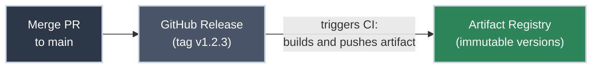
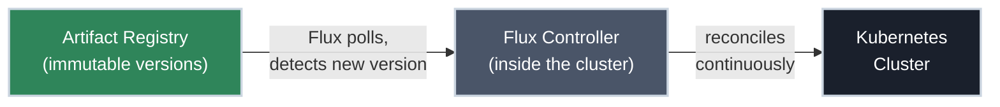
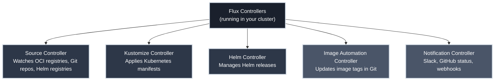

# What Is GitOps?

!!! tip "Part of Day One: Understanding GitOps"
    This is the foundation. Before understanding [FluxCD](https://fluxcd.io/flux/), Kustomizations, or HelmReleases, you need to understand why GitOps exists and what problem it's actually solving.

You've been told your team uses GitOps. Maybe someone mentioned Flux. Maybe deployments changed and you're not sure why. This article answers the "why" — which makes everything else click into place.

!!! info "What You'll Learn"
    - What GitOps is (and isn't)
    - The problem GitOps solves
    - How the GitOps reconciliation loop works
    - Where [FluxCD](https://fluxcd.io/flux/) fits in the picture
    - What changes for you as someone who deploys applications

---

## The Problem GitOps Solves

Before GitOps, deploying to [Kubernetes](https://k8s.bradpenney.io/day_one/what_is_kubernetes/) looked something like this:

```bash title="The Pre-GitOps Way"
kubectl apply -f deployment.yaml
kubectl set image deployment/my-app my-app=my-registry/my-app:v2.1.0
helm upgrade my-release ./chart --set image.tag=v2.1.0
```

These commands work. But they create invisible state. **The cluster knows what's running. Git doesn't.**

This leads to real problems:

<div class="grid cards two-col" markdown>

-   :material-sync-alert: **Drift**

    ---

    Someone ran `kubectl edit` to fix an incident at 2 AM. The change works, so it stays. Six months later, nobody knows why that config value is different from what's in Git. The cluster has drifted from what anyone intended.

    **GitOps: the cluster continuously reconciles back to its declared state. Drift can't hide.**

-   :material-history: **No Audit Trail**

    ---

    Who deployed version 3.2.1? When? What changed between that and 3.2.0? With [`kubectl apply`](https://k8s.bradpenney.io/day_one/kubectl/first_deploy/), that information lives in cluster events — which expire — or in someone's shell history.

    **GitOps: every change is a Git commit. The full history is there, with author, timestamp, and diff.**

-   :material-undo: **Hard Rollbacks**

    ---

    Something broke. You need to get back to the last working state. With manual deploys, "last working state" means finding the right image tag, running the right Helm command, hoping nothing else changed.

    **GitOps: every release is an immutable, tested artifact. Roll back by pinning the last known-good version — nothing to reconstruct.**

-   :material-lock-alert: **Inconsistent Environments**

    ---

    Production got a hotfix that never made it back to staging. Staging has a config value that production doesn't. You're debugging a staging issue that can't reproduce in production, or vice versa.

    **GitOps: each environment runs a specific, immutable artifact version, and you promote the same version forward. No environment carries a change the others can't see.**

</div>

---

## The GitOps Approach

GitOps has one core principle:

> **Git is the single source of truth for your cluster's desired state.**

The cluster doesn't just get deployed to. You declare the desired state in Git; CI packages it into an immutable, versioned artifact; and the cluster continuously *reconciles* toward that artifact. If you want something different running, you change Git — which produces a new version. If someone changes the cluster directly, the reconciliation loop reverses it.

Here's what that looks like in practice. First, your change becomes a versioned artifact:



Then, inside the cluster, Flux reconciles toward that artifact — continuously:



Notice what's missing: there's no step where you run [`kubectl apply`](https://k8s.bradpenney.io/day_one/kubectl/first_deploy/). The cluster pulls its own desired state — as a versioned artifact — and applies it continuously.

One nuance these diagrams simplify: **dev and staging** can reconcile to each new version automatically, but **production is pinned** to a specific, tested version and moved forward by a deliberate promotion — it doesn't chase every new build. [Your Flux Workflow](your_flux_workflow.md) shows how that promotion happens.

---

## The Four Principles of GitOps

GitOps isn't just a tool preference — it's a set of principles. The [OpenGitOps working group](https://opengitops.dev/) defines four:

=== "Declarative"

    Your system's desired state is declared, not scripted. Instead of saying "run these five commands to deploy," you say "here is the YAML describing what should exist." Kubernetes is already declarative — GitOps extends this principle to the delivery pipeline itself.

    **What this means for you:** Your Helm values files, Kubernetes manifests, and Kustomizations are the source of truth — not the commands used to apply them.

=== "Versioned and Immutable"

    Every change is a commit in Git, and every release is packaged as an immutable, semver-tagged artifact — `registry/my-app-config:v1.2.3` is the same bytes today as the day it shipped. Git preserves *who changed what and when*; the artifact preserves *exactly what was deployed*. A mutable Git branch can't give you that — `main` today isn't `main` last week, but `v1.2.3` never changes.

    **What this means for you:** Your authorship trail is `git log`. The precise, immutable version that ran is the artifact tag — that's what you pin to, audit, and roll back to.

=== "Pulled Automatically"

    A software agent inside the cluster *pulls* the desired state from its source — the artifact registry — and applies it. You don't push changes into the cluster; the cluster pulls them.

    **This is the key mental shift.** You're not pushing to the cluster. The cluster pulls its desired state on its own.

=== "Continuously Reconciled"

    The agent doesn't just apply state once. It continuously compares what's actually running against the declared desired state, and corrects any drift. If someone manually changes something in the cluster, the agent reverses it.

    **What this means for you:** The cluster will always reflect what's in Git. Manual changes don't stick.

---

## Where FluxCD Fits In

!!! info "FluxCD and ArgoCD: The Two Dominant GitOps Tools"
    [FluxCD](https://fluxcd.io/flux/) and [ArgoCD](https://argo-cd.readthedocs.io/en/stable/) are the two most widely used GitOps controllers for Kubernetes — both are CNCF projects, both implement the same four principles, and both will feel familiar once you understand the paradigm.

    **This site covers FluxCD exclusively.** If your company uses ArgoCD, the mental model in Day One still applies — the concepts transfer directly, but the specific resources, commands, and workflows are different.

[FluxCD](https://fluxcd.io/flux/) is the agent that implements these principles for Kubernetes. It runs inside your cluster as a set of controllers, watches your sources — OCI artifact registries, Git repositories, Helm registries — and continuously reconciles the cluster toward your declared desired state.



Flux is composed of several controllers, each responsible for a specific part of the GitOps pipeline:

- **[Source Controller](https://fluxcd.io/flux/components/source/)** — watches OCI artifact registries, Git repositories, and Helm registries for changes
- **[Kustomize Controller](https://fluxcd.io/flux/components/kustomize/)** — applies Kubernetes YAML (via Kustomize overlays or plain manifests)
- **[Helm Controller](https://fluxcd.io/flux/components/helm/)** — manages Helm releases declaratively
- **[Image Automation Controller](https://fluxcd.io/flux/components/image/)** — can automatically update image tags in Git when new images are built
- **[Notification Controller](https://fluxcd.io/flux/components/notification/)** — sends deployment events to Slack, GitHub status checks, etc.

You don't need to understand all of these on Day One. The important thing is that Flux runs *inside* your cluster, polls your sources, and does the applying — you don't.

---

## What Changes for You

If you've deployed to Kubernetes before, here's the practical shift:

| Before GitOps | With GitOps (FluxCD) |
|--------------|----------------------|
| [`kubectl apply -f deployment.yaml`](https://k8s.bradpenney.io/day_one/kubectl/first_deploy/) | Commit your manifests to Git, open a PR, merge |
| `helm upgrade my-app ./chart` | Edit `values.yaml` in Git, open a PR, merge |
| `kubectl set image deployment/...` | Commit your updated app code — CI builds a versioned artifact; Flux deploys that version once it's promoted |
| "Did that deploy?" → check `kubectl rollout status` | "Did that deploy?" → [check Flux reconciliation status](reading_flux_status.md) |
| Rollback: `kubectl rollout undo` | SRE pins the artifact version; or revert your commit and let CI rebuild |

!!! info "Who's Who: SRE vs Platform Team"
    Two roles show up throughout Day One. The **platform team** builds and maintains the GitOps platform itself — installing Flux, wiring up sources, registries, and integrations. The **SRE** (site reliability engineer) owns production support and monitoring — incident response, rollbacks, and on-call. The **developer** (you) writes the code, merges the PR, and authors the deployment manifests. One boundary worth knowing now: publishing a new version and *promoting* it to production are separate rights — you publish, an SRE promotes. [Your Flux Workflow](your_flux_workflow.md) details that split.

The muscle memory changes, but the underlying Kubernetes concepts don't. Pods still run. Deployments still manage ReplicaSets. Services still route traffic. GitOps changes *how* you describe what you want — not what Kubernetes does with that description.

!!! warning "Manual Changes Don't Stick"
    In a GitOps-managed cluster, [`kubectl apply`](https://k8s.bradpenney.io/day_one/kubectl/first_deploy/) and `kubectl edit` still work — but Flux will reverse them on the next reconciliation cycle (usually within minutes). If you need a change to persist, it must go through Git.

    This is by design. It's the "continuously reconciled" principle in action.

---

## Practice Exercises

??? question "Exercise 1: Spot the GitOps Violation"
    Review the following scenario and identify what violates GitOps principles:

    *An incident occurs at 2 AM. The on-call SRE connects to the cluster and runs `kubectl edit configmap app-config` to change a database connection string. The incident resolves. The SRE goes to sleep. The next morning, Flux reconciles and reverts the configmap to its declared state. The incident recurs.*

    What went wrong, and what should the SRE have done instead?

    ??? tip "Solution"
        **What went wrong:** The SRE made a manual change directly to the cluster, bypassing Git. Flux's continuous reconciliation reverted it on the next sync cycle — which is exactly what it's supposed to do.

        **What should have happened:**

        1. Pause reconciliation so Flux won't immediately revert the fix — this buys time during the incident
        2. Apply the emergency fix directly to the cluster (the fix itself was correct)
        3. **Immediately** commit the same change to Git and get it merged
        4. Release it — a new versioned artifact is built with the fix baked in
        5. Resume reconciliation; the cluster reconciles to that new artifact, and the fix is now part of the declared, versioned state

        In GitOps, break-glass emergency changes are acceptable for incidents — but a manual change to the cluster only holds until the next reconciliation, which is exactly why the original fix vanished overnight. Pausing reconciliation lets the fix stick while you prepare the real one. To make it permanent the fix still has to flow through the pipeline: commit, release, new artifact. The cluster fix buys you time; the new released artifact makes it stick.

??? question "Exercise 2: Identify the Source of Truth"
    Your application is running `my-app:v3.1.0` in the cluster, but the released artifact Flux is reconciling against is `v2.9.0`.

    In a GitOps environment, what should you expect to happen next? What does this state tell you about the cluster?

    ??? tip "Solution"
        **What to expect:** Flux will reconcile the cluster back to its declared state — the `v2.9.0` artifact — replacing `v3.1.0` with `v2.9.0`. This is GitOps working correctly.

        **What this state tells you:** Someone changed the running cluster directly, bypassing the artifact Flux reconciles against. The cluster has drifted. Either:

        - Someone ran `kubectl set image` or `kubectl edit` directly
        - A pipeline deployed straight to the cluster instead of through a released artifact

        In any case, the cluster will converge to the declared `v2.9.0` artifact. This is not a bug — it's the continuous reconciliation principle. If `v3.1.0` is what you want, it has to become the declared version: commit it and release it as a new artifact.

---

## Quick Recap

| Concept | What It Means |
|---------|--------------|
| **GitOps** | You declare intent in Git; the cluster continuously reconciles toward the released artifact built from it |
| **Declarative** | You describe *what* you want, not *how* to get there |
| **Versioned artifact** | An immutable, semver-tagged package of your manifests — what the cluster actually reconciles against |
| **Reconciliation** | Flux continuously compares and corrects cluster state toward its declared state |
| **Pull-based** | The cluster pulls its desired state from the registry — you don't push to the cluster |
| **FluxCD** | The controller that implements GitOps for Kubernetes |
| **Manual change** | Still works, but Flux reverts it on the next reconciliation |

---

## What's Next

Now that you understand the paradigm, the next step is seeing how your day-to-day workflow changes:

- **[Your Flux Workflow](your_flux_workflow.md)** — from PR to deployed application, step by step

---

## Further Reading

### Official Documentation

- [OpenGitOps Principles](https://opengitops.dev/) — the vendor-neutral definition of GitOps
- [FluxCD Documentation](https://fluxcd.io/flux/) — the official Flux docs, well-written and comprehensive

### The Alternative

- [ArgoCD Documentation](https://argo-cd.readthedocs.io/en/stable/) — the direct competitor to FluxCD; same GitOps principles, different architecture, UI-first approach — worth knowing exists even if your company uses Flux

### Related Learning

- [What Is Kubernetes?](https://k8s.bradpenney.io/day_one/what_is_kubernetes/) — New to Kubernetes? Start here before diving into GitOps
- [Essential kubectl Commands](https://k8s.bradpenney.io/day_one/kubectl/commands/) — The `kubectl get`, `kubectl describe`, and `kubectl apply` commands referenced in this article

### Related Articles

- [Day One Overview](overview.md) — what to expect from the Day One section
