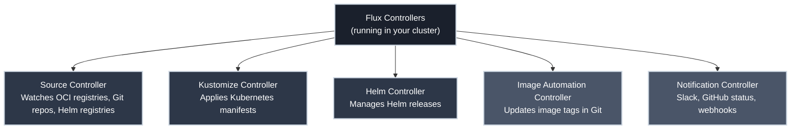

# What Is GitOps?

!!! tip "Part of Day One: Understanding GitOps"
    This is the foundation. Before understanding [FluxCD](https://fluxcd.io/flux/), Kustomizations, or HelmReleases, you need to understand why GitOps exists and what problem it's actually solving.

You've been told your team uses GitOps. Maybe someone mentioned Flux. Maybe deployments changed and you're not sure why. This article answers the "why" — which makes everything else click into place.

!!! info "What You'll Learn"
    - What GitOps is (and isn't)
    - The problem GitOps solves
    - How the GitOps reconciliation loop works
    - Where [FluxCD](https://fluxcd.io/flux/) fits in the picture
    - What changes for you as someone who deploys applications

---

## The Problem GitOps Solves

Before GitOps, deploying to [Kubernetes](https://k8s.bradpenney.io/day_one/what_is_kubernetes/) looked something like this:

```bash title="The Pre-GitOps Way"
kubectl apply -f deployment.yaml
kubectl set image deployment/my-app my-app=my-registry/my-app:v2.1.0
helm upgrade my-release ./chart --set image.tag=v2.1.0
```

These commands work. But they create invisible state. **The cluster knows what's running. Git doesn't.**

This leads to real problems:

<div class="grid cards" markdown>

-   :material-question-mark: **Drift**

    ---

    Someone ran `kubectl edit` to fix an incident at 2 AM. The change works, so it stays. Six months later, nobody knows why that config value is different from what's in Git. The cluster has drifted from what anyone intended.

    **GitOps: the cluster continuously reconciles back to Git. Drift can't hide.**

-   :material-history: **No Audit Trail**

    ---

    Who deployed version 3.2.1? When? What changed between that and 3.2.0? With `kubectl apply`, that information lives in cluster events — which expire — or in someone's shell history.

    **GitOps: every change is a Git commit. The full history is there, with author, timestamp, and diff.**

-   :material-undo: **Hard Rollbacks**

    ---

    Something broke. You need to get back to the last working state. With manual deploys, "last working state" means finding the right image tag, running the right Helm command, hoping nothing else changed.

    **GitOps: rollback is `git revert`. The cluster follows.**

-   :material-lock-alert: **Inconsistent Environments**

    ---

    Production got a hotfix that never made it back to staging. Staging has a config value that production doesn't. You're debugging a staging issue that can't reproduce in production, or vice versa.

    **GitOps: environments are defined in Git. Differences are explicit and version-controlled.**

</div>

---

## The GitOps Approach

GitOps has one core principle:

> **Git is the single source of truth for your cluster's desired state.**

The cluster doesn't just get deployed to. It continuously *reconciles* toward whatever Git says it should look like. If you want something different running, you change Git. If someone changes the cluster directly, the reconciliation loop reverses it.

Here's what that looks like in practice:


Notice what's missing: there's no step where you run `kubectl apply`. The cluster pulls its own desired state from Git and applies it continuously.

---

## The Four Principles of GitOps

GitOps isn't just a tool preference — it's a set of principles. The [OpenGitOps working group](https://opengitops.dev/) defines four:

=== "Declarative"

    Your system's desired state is declared, not scripted. Instead of saying "run these five commands to deploy," you say "here is the YAML describing what should exist." Kubernetes is already declarative — GitOps extends this principle to the delivery pipeline itself.

    **What this means for you:** Your Helm values files, Kubernetes manifests, and Kustomizations are the source of truth — not the commands used to apply them.

=== "Versioned and Immutable"

    The desired state is stored in Git. Every change is a commit. History is preserved. You can see exactly what was running at any point in time — and who changed it.

    **What this means for you:** Your deployment history is your Git history. `git log` tells you what changed and when.

=== "Pulled Automatically"

    A software agent inside the cluster *pulls* the desired state from Git and applies it. You don't push changes into the cluster — the cluster pulls changes from Git.

    **This is the key mental shift.** You're not pushing to the cluster. The cluster pulls from Git.

=== "Continuously Reconciled"

    The agent doesn't just apply state once. It continuously compares what's actually running against what Git says should be running, and corrects any drift. If someone manually changes something in the cluster, the agent reverses it.

    **What this means for you:** The cluster will always reflect what's in Git. Manual changes don't stick.

---

## Where FluxCD Fits In

!!! info "FluxCD and ArgoCD: The Two Dominant GitOps Tools"
    [FluxCD](https://fluxcd.io/flux/) and [ArgoCD](https://argo-cd.readthedocs.io/en/stable/) are the two most widely used GitOps controllers for Kubernetes — both are CNCF projects, both implement the same four principles, and both will feel familiar once you understand the paradigm.

    **This site covers FluxCD exclusively.** If your company uses ArgoCD, the mental model in Day One still applies — the concepts transfer directly, but the specific resources, commands, and workflows are different.

[FluxCD](https://fluxcd.io/flux/) is the agent that implements these principles for Kubernetes. It runs inside your cluster as a set of controllers, watches your sources — OCI artifact registries, Git repositories, Helm registries — and continuously reconciles the cluster toward your declared desired state.



Flux is composed of several controllers, each responsible for a specific part of the GitOps pipeline:

- **[Source Controller](https://fluxcd.io/flux/components/source/)** — watches OCI artifact registries, Git repositories, and Helm registries for changes
- **[Kustomize Controller](https://fluxcd.io/flux/components/kustomize/)** — applies Kubernetes YAML (via Kustomize overlays or plain manifests)
- **[Helm Controller](https://fluxcd.io/flux/components/helm/)** — manages Helm releases declaratively
- **[Image Automation Controller](https://fluxcd.io/flux/components/image/)** — can automatically update image tags in Git when new images are built
- **[Notification Controller](https://fluxcd.io/flux/components/notification/)** — sends deployment events to Slack, GitHub status checks, etc.

You don't need to understand all of these on Day One. The important thing is that Flux runs *inside* your cluster, polls your sources, and does the applying — you don't.

---

## What Changes for You

If you've deployed to Kubernetes before, here's the practical shift:

| Before GitOps | With GitOps (FluxCD) |
|--------------|----------------------|
| `kubectl apply -f deployment.yaml` | Commit your manifests to Git, open a PR, merge |
| `helm upgrade my-app ./chart` | Edit `values.yaml` in Git, open a PR, merge |
| `kubectl set image deployment/...` | Commit your updated app code — CI builds a versioned artifact, Flux applies it |
| "Did that deploy?" → check `kubectl rollout status` | "Did that deploy?" → check Flux reconciliation status |
| Rollback: `kubectl rollout undo` | Platform team pins the artifact version; or revert your commit and let CI rebuild |

The muscle memory changes, but the underlying Kubernetes concepts don't. Pods still run. Deployments still manage ReplicaSets. Services still route traffic. GitOps changes *how* you describe what you want — not what Kubernetes does with that description.

!!! warning "Manual Changes Don't Stick"
    In a GitOps-managed cluster, [`kubectl apply`](https://k8s.bradpenney.io/day_one/kubectl/commands/) and `kubectl edit` still work — but Flux will reverse them on the next reconciliation cycle (usually within minutes). If you need a change to persist, it must go through Git.

    This is by design. It's the "continuously reconciled" principle in action.

---

## A Concrete Example

Your team ships a new feature. Here's what the enterprise GitOps workflow looks like:

```mermaid
flowchart LR
    Code["1. You commit\nthe new feature"]
    PR["2. You open\na Pull Request"]
    Review["3. Teammate\nreviews and merges"]
    CI["4. CI builds a\nversioned OCI artifact\n(v2.1.0)"]
    Registry["5. Artifact pushed\nto enterprise registry\n(Harbor / ECR)"]
    Flux["6. Flux detects\nv2.1.0 in registry"]
    Running["7. v2.1.0 is\nrunning in the cluster"]

    Code --> PR --> Review --> CI --> Registry --> Flux --> Running

    style Code fill:#2d3748,stroke:#cbd5e0,stroke-width:2px,color:#fff
    style PR fill:#2d3748,stroke:#cbd5e0,stroke-width:2px,color:#fff
    style Review fill:#2d3748,stroke:#cbd5e0,stroke-width:2px,color:#fff
    style CI fill:#4a5568,stroke:#cbd5e0,stroke-width:2px,color:#fff
    style Registry fill:#4a5568,stroke:#cbd5e0,stroke-width:2px,color:#fff
    style Flux fill:#4a5568,stroke:#cbd5e0,stroke-width:2px,color:#fff
    style Running fill:#2f855a,stroke:#cbd5e0,stroke-width:2px,color:#fff
```



Steps 1-3 are yours. Steps 4-7 are automated. You don't touch `kubectl`, `helm upgrade`, or image tags. You commit your changes to Git, merge the PR, and let CI and Flux handle the rest.

---

## Practice Exercises

??? question "Exercise 1: Spot the GitOps Violation"
    Review the following scenario and identify what violates GitOps principles:

    *An incident occurs at 2 AM. The on-call engineer connects to the cluster and runs `kubectl edit configmap app-config` to change a database connection string. The incident resolves. The engineer goes to sleep. The next morning, Flux reconciles and reverts the configmap to what Git says it should be. The incident recurs.*

    What went wrong, and what should the engineer have done instead?

    ??? tip "Solution"
        **What went wrong:** The engineer made a manual change directly to the cluster, bypassing Git. Flux's continuous reconciliation reverted it on the next sync cycle — which is exactly what it's supposed to do.

        **What should have happened:**

        1. Apply the emergency fix directly to the cluster (the fix itself was correct)
        2. **Immediately** commit the same change to Git and get it merged
        3. Verify Flux reconciles the Git version (now matching the fix)

        In GitOps, break-glass emergency changes to the cluster are acceptable for incidents — but they must be followed immediately by a Git commit that captures the fix. The cluster fix buys you time. The Git commit makes it permanent.

??? question "Exercise 2: Identify the Source of Truth"
    Your application is running `my-app:v3.1.0` in the cluster, but your Git repository has `image: my-registry/my-app:v2.9.0` in the deployment manifest.

    In a GitOps environment, what should you expect to happen next? What does this state tell you about the cluster?

    ??? tip "Solution"
        **What to expect:** Flux will reconcile the cluster toward Git — meaning it will replace `v3.1.0` with `v2.9.0`. This is GitOps working correctly.

        **What this state tells you:** Someone applied a manual change to the cluster that isn't reflected in Git. The cluster has drifted. Either:

        - Someone ran `kubectl set image` or `kubectl edit` directly
        - A CI/CD pipeline deployed directly to the cluster instead of through Git
        - Image automation updated the running container but the Git commit is pending

        In any case, the cluster will converge to Git's declared state. This is not a bug — it's the continuous reconciliation principle. If `v3.1.0` is what you want, update Git to say so.

---

## Quick Recap

| Concept | What It Means |
|---------|--------------|
| **GitOps** | Git is the source of truth; the cluster continuously reconciles toward it |
| **Declarative** | You describe *what* you want, not *how* to get there |
| **Reconciliation** | Flux continuously compares and corrects cluster state toward Git |
| **Pull-based** | The cluster pulls from Git — you don't push to the cluster |
| **FluxCD** | The controller that implements GitOps for Kubernetes |
| **Manual change** | Still works, but Flux will revert it on the next sync cycle |

---

## What's Next

Now that you understand the paradigm, the next step is seeing how your day-to-day workflow changes:

- **[Your Flux Workflow](your_flux_workflow.md)** — from PR to deployed application, step by step

---

## Further Reading

### Official Documentation

- [OpenGitOps Principles](https://opengitops.dev/) — the vendor-neutral definition of GitOps
- [FluxCD Documentation](https://fluxcd.io/flux/) — the official Flux docs, well-written and comprehensive
- [CNCF GitOps Working Group](https://github.com/cncf/tag-app-delivery/tree/main/gitops-wg) — the standards body behind GitOps

### The Alternative

- [ArgoCD Documentation](https://argo-cd.readthedocs.io/en/stable/) — the direct competitor to FluxCD; same GitOps principles, different architecture, UI-first approach — worth knowing exists even if your company uses Flux

### Related Learning

- [What Is Kubernetes?](https://k8s.bradpenney.io/day_one/what_is_kubernetes/) — New to Kubernetes? Start here before diving into GitOps
- [Essential kubectl Commands](https://k8s.bradpenney.io/day_one/kubectl/commands/) — The `kubectl get`, `kubectl describe`, and `kubectl apply` commands referenced in this article

### Related Articles

- [Day One Overview](overview.md) — what to expect from the Day One section
