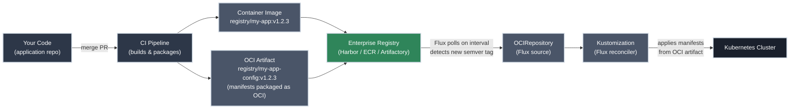
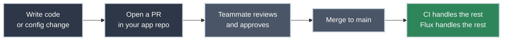

# Your Flux Workflow

!!! tip "Part of Day One: Understanding GitOps"
    Before reading this article, make sure you've read [What Is GitOps?](what_is_gitops.md). This article builds directly on the reconciliation model explained there.

You merged your PR. The CI pipeline ran. Now you're wondering: *did it actually deploy?*

In enterprise GitOps, the answer to that question is not "Flux checked GitHub and applied your YAML." It's something more robust than that.

!!! info "What You'll Learn"
    - Why enterprise GitOps uses OCI artifacts, not direct Git polling
    - The full pipeline from your code commit to a running deployment
    - What your role as a developer actually is (smaller than you think)
    - How to verify your version is live

---

## Why Not Just Poll GitHub?

A common misconception about GitOps is that Flux watches your GitHub repository and applies changes when you merge. Some tutorials teach this pattern. **It is not enterprise-grade.**

Here's why:

-   :material-server-off: **Runtime Dependency on a Git Forge**

    ---

    If Flux polls GitHub directly, your deployment pipeline has a hard runtime dependency on GitHub's availability. GitHub has outages. When it does, Flux can't fetch your manifests. In a proper enterprise setup, already-running workloads keep running — but no new deployments or config changes can reconcile until the forge comes back.

    **Enterprise standard:** Flux reads from an artifact registry, not a Git forge.

-   :material-tag-off: **No Semantic Versioning**

    ---

    A Git branch is mutable. `main` today is not the same as `main` yesterday. There is no stable, versioned reference to "the manifests that produced version 1.2.3 of this application."

    **Enterprise standard:** OCI artifacts are tagged with semantic versions. `registry/my-app-config:v1.2.3` is immutable. You can audit, roll back to, or promote any specific version by tag.

-   :material-shield-off: **No Enterprise Artifact Management**

    ---

    GitHub is a code forge. Enterprise artifact registries (Harbor, AWS ECR, JFrog Artifactory) provide vulnerability scanning, access control policies, retention rules, artifact signing, and promotion workflows.

    **Enterprise standard:** Kubernetes manifests are artifacts. Treat them like artifacts.

---

## The Enterprise GitOps Pipeline

In a properly architected GitOps environment, the flow looks like this:

Two artifacts come out of your CI pipeline for every release:

- **The container image** — the application itself, tagged `v1.2.3`, pushed to your registry
- **The OCI manifest artifact** — your Kubernetes manifests packaged as an OCI image, also tagged `v1.2.3`, pushed to the same registry

Flux watches the manifest artifact via an [`OCIRepository`](https://fluxcd.io/flux/components/source/ocirepositories/) resource. When it detects a new version that satisfies its semver policy (e.g., `>=1.2.0`), it fetches the artifact and applies the manifests to the cluster. **Flux never connects to GitHub at runtime.**

---

## Your Role as a Developer

In an enterprise GitOps environment, your workflow is deliberately minimal:

You do not:

- Push to the cluster directly
- Edit image tags in a config repo
- Trigger deployments manually
- Touch the OCI artifact or the registry

Your CI pipeline does all of that. **Your job ends at the merge.**

!!! tip "Where Are the Manifests?"
    Your Kubernetes manifests live in your application repository alongside your code — or in a dedicated manifests repo that your team owns. Either way, changes to manifests follow the same PR workflow as code changes. CI packages whatever is on `main` into the next versioned OCI artifact.

---

## What Gets Versioned

The OCI artifact is tagged with a semantic version that ties together the container image and the manifests. A tag like `v1.2.3` on the manifest artifact means:

- The container image in the Deployment spec is `registry/my-app:v1.2.3`
- The replica count, resource limits, ConfigMap values, and everything else in the manifests are exactly what was on `main` when `v1.2.3` was built
- This combination has been tested in CI
- This exact state can be deployed, rolled back to, or promoted to production by referencing `v1.2.3`

This is the version your operations team will reference in incident reports, deployment logs, and change management records.

---

## Rolling Back

In this model, a rollback is an operation your platform team can perform without touching Git at all — by pinning the `OCIRepository` to an earlier semver tag. For you as a developer, a rollback might also be initiated by reverting your commit and letting CI build a new `v1.2.4` that looks like `v1.2.1`.

Either way: you don't reach for `kubectl rollout undo`. The artifact registry is the source of truth for what version should be running.

---

## Practice Exercises

??? question "Exercise 1: Why Not Git?"
    Your colleague suggests: "Instead of all this OCI artifact complexity, why don't we just have Flux watch the `main` branch of our GitHub repo directly? It's simpler."

    **What are the three strongest arguments against this in an enterprise environment?**

    ??? tip "Solution"
        1. **Runtime dependency on GitHub.** If GitHub has an outage, Flux cannot reconcile. New deployments and config changes stall until GitHub returns. An enterprise registry (Harbor, ECR, Artifactory) is purpose-built for high availability and does not carry this risk.

        2. **No semantic versioning.** A branch is mutable — `main` today is not the same as `main` last week. You cannot pin, audit, or roll back to a specific version of "what Flux was applying on Tuesday." An OCI artifact at `v1.2.3` is immutable and permanently auditable.

        3. **No artifact management.** Enterprise registries provide vulnerability scanning, signing, access control, and retention policies. GitHub provides none of these for your Kubernetes manifests.

??? question "Exercise 2: Trace the Pipeline"
    Your team merges a PR that changes the log level in a ConfigMap from `info` to `debug`.

    **Trace the full pipeline from merge to cluster update. What produces the new OCI artifact? What does it contain? How does Flux detect it?**

    ??? tip "Solution"
        1. **PR merges** to `main` in the application repo
        2. **CI triggers** — detects the change, determines the next semantic version (e.g., `v2.4.1`)
        3. **CI packages** the updated manifests (including the ConfigMap with `LOG_LEVEL: debug`) as an OCI artifact tagged `v2.4.1` and pushes it to the enterprise registry
        4. **Flux's OCIRepository** polls the registry on its interval (e.g., every 5 minutes), detects `v2.4.1` satisfies its semver policy (`>=2.0.0`), and fetches the artifact
        5. **Flux's Kustomization** compares the fetched manifests to the cluster state, finds the ConfigMap differs, and applies the update
        6. **Cluster updated** — the ConfigMap now contains `LOG_LEVEL: debug`

??? question "Exercise 3: Who Owns the Rollback?"
    A deployment of `v3.1.0` is causing elevated error rates. The on-call engineer needs to roll back to `v3.0.8` immediately.

    **In this OCI-based GitOps setup, who performs the rollback and how?**

    ??? tip "Solution"
        The **platform engineer on call** performs the rollback — not the application developer.

        They pin the `OCIRepository` to `v3.0.8` by updating the semver constraint or specifying the tag directly. Flux immediately reconciles to the `v3.0.8` manifests from the artifact registry. No Git operations required for the emergency rollback.

        The **application developer** may then open a PR to fix the issue in code, which CI builds as `v3.1.1` — superseding the broken `v3.1.0` and restoring forward momentum.

        This separation — platform team owns the rollback, dev team owns the fix — is a feature of the enterprise pattern, not a limitation.

---

## Quick Recap

| Question | Answer |
|----------|--------|
| What does Flux poll in production? | An enterprise OCI artifact registry — not GitHub |
| What is the deployment artifact? | An OCI image containing versioned Kubernetes manifests |
| What is your job as a developer? | Commit code, open PR, merge — CI and Flux handle the rest |
| How are deployments versioned? | Semantic version tags on the OCI artifact (`v1.2.3`) |
| How do you roll back? | Platform team pins the `OCIRepository` to an earlier semver tag |

---

## What's Next

You understand how your changes flow from code to cluster. The next question is: **how do you verify it worked?**

**[Reading Flux Status](reading_flux_status.md)** covers the `kubectl` commands that tell you whether Flux reconciled your OCI artifact successfully — and how to interpret the errors when it didn't.

---

## Further Reading

### Official Documentation

- [FluxCD: OCIRepository](https://fluxcd.io/flux/components/source/ocirepositories/) — the Flux source type that watches your artifact registry; covers the full spec, authentication, and status fields

### The Alternative

- [ArgoCD Documentation](https://argo-cd.readthedocs.io/en/stable/) — the direct competitor to FluxCD; same GitOps principles, different architecture

### Related Learning

- [Essential kubectl Commands](https://k8s.bradpenney.io/day_one/kubectl/commands/) — `kubectl get` and `kubectl describe` for verifying changes applied after a reconciliation
- [Your First Helm Deployment](https://k8s.bradpenney.io/day_one/helm/first_deploy/) — New to Helm? Helm charts can also be packaged and delivered as OCI artifacts

### Related Articles

- [What Is GitOps?](what_is_gitops.md) — the paradigm behind everything in this article
- [Day One Overview](overview.md) — the full Day One learning path
