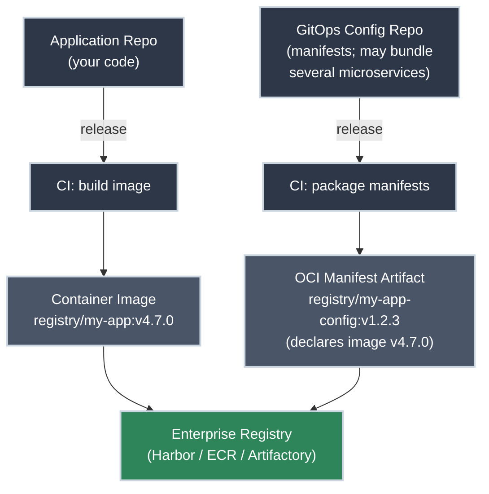
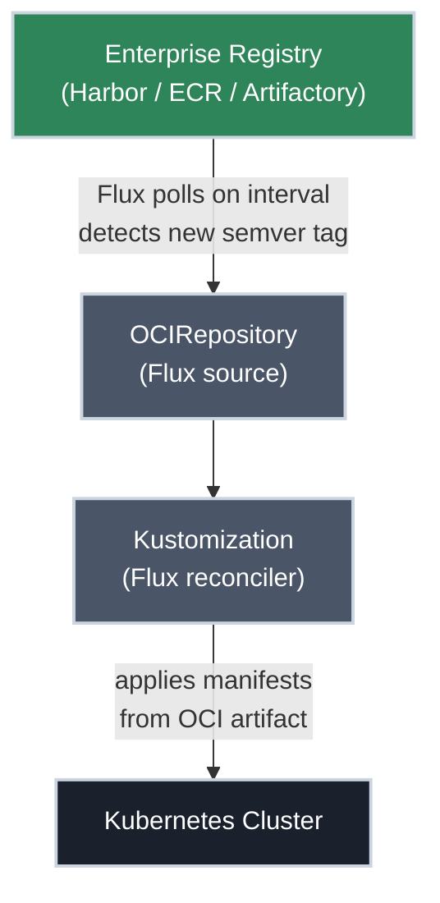
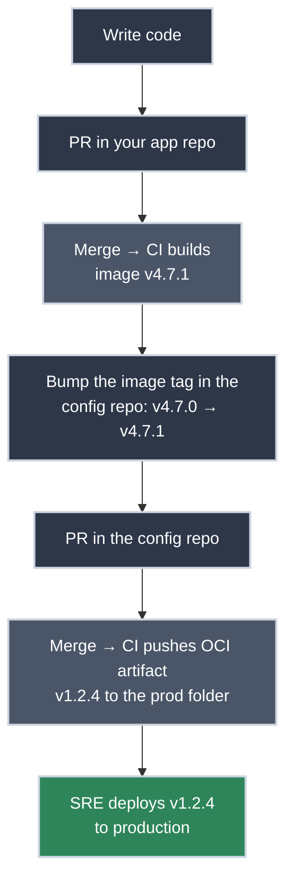

# Your Flux Workflow

!!! tip "Part of Day One: Understanding GitOps"
    Before reading this article, make sure you've read [What Is GitOps?](what_is_gitops.md). This article builds directly on the reconciliation model explained there.

You merged your PR, a release was cut, and CI ran. Now you're wondering: *did it actually deploy?*

In enterprise GitOps, the answer to that question is not "Flux checked GitHub and applied your YAML." It's something more robust than that.

!!! info "What You'll Learn"
    - Why enterprise GitOps uses OCI artifacts, not direct Git polling
    - The full pipeline from your code commit to a running deployment
    - What your role as a developer actually is (smaller than you think)
    - How to verify your version is live

---

## Why Not Just Poll GitHub?

A common misconception about GitOps is that Flux watches your GitHub repository and applies changes when you merge. Some tutorials teach this pattern. **It is not enterprise-grade.**

Here's why:

<div class="grid cards two-col" markdown>

-   :material-server-off: **Runtime Dependency on a Git Forge**

    ---

    A Git forge is developer-grade infrastructure — built for code review and collaboration, not to sit in the critical path of production reconciliation. Point Flux at GitHub or GitLab and your cluster's ability to deploy now depends on that forge staying up. Forges have outages, and a self-hosted GitHub Enterprise or GitLab instance is often *less* resilient than the managed service — exactly the runtime dependency you don't want under production.

    An artifact registry (Harbor, ECR, Artifactory) is the opposite: enterprise-grade, highly available, and purpose-built to be pulled from continuously. When a forge does go down, already-running workloads keep serving traffic — but nothing new reconciles until it's back. Depend on infrastructure designed for the job.

    **Enterprise standard:** Flux reads from an artifact registry, not a Git forge.

-   :material-tag-off: **No Semantic Versioning**

    ---

    A Git branch is mutable. `main` today is not the same as `main` yesterday. There is no stable, versioned reference to "the manifests that produced version 1.2.3 of this application."

    **Enterprise standard:** OCI artifacts are tagged with semantic versions. `registry/my-app-config:v1.2.3` is immutable. You can audit, roll back to, or promote any specific version by tag.

-   :material-shield-off: **No Enterprise Artifact Management**

    ---

    GitHub is a code forge. Enterprise artifact registries (Harbor, AWS ECR, JFrog Artifactory) provide vulnerability scanning, access control policies, retention rules, artifact signing, and promotion workflows.

    **Enterprise standard:** Kubernetes manifests are artifacts. Treat them like artifacts.

</div>

---

## The Enterprise GitOps Pipeline

In a properly architected GitOps environment, the flow has two halves. First, two repositories — your application code and your GitOps config — each release an artifact to the registry:



Two repos, two pipelines, two artifacts — both landing in the same registry:

- **The container image** — built from your **application repo**, versioned on its own track (say `v4.7.0`)
- **The OCI manifest artifact** — built from your **GitOps config repo**, versioned separately (say `v1.2.3`). The manifests inside declare which image tag to run — `v4.7.0` here. **This artifact tag, not the image tag, is what Flux watches.**

Once both are in the registry, the second half takes over — Flux reconciles the cluster from the OCI manifest artifact:



Flux watches the manifest artifact via an [`OCIRepository`](https://fluxcd.io/flux/components/source/ocirepositories/) resource, which references a tag or a semver policy. When a matching version is available, Flux fetches the artifact and applies the manifests to the cluster. **Flux never connects to GitHub at runtime.**

!!! warning "Production Pins, It Doesn't Float"
    A loose semver range like `>=1.2.0` will pull the newest matching artifact — fine for a dev or staging environment, but **not** how production should work. Production environments pin to a specific, tested version (e.g. `v1.2.3`) and are moved forward deliberately through promotion. Production never chases "latest."

---

## Your Role as a Developer

In an enterprise GitOps environment, your workflow is deliberately minimal:



Two repos, two PRs — but it's all the same kind of work: edit, open a PR, get it reviewed, merge. You bump the image tag in the config repo by hand, and its release flow pushes the new OCI artifact into the **production folder** of the registry.

Concretely, that "bump" is usually a one-line change to a manifest:

```diff title="The change you make in the config repo (deployment.yaml)" linenums="1"
       containers:
         - name: my-app
-          image: registry.company.com/my-app:v4.7.0
+          image: registry.company.com/my-app:v4.7.1
```

PR it, get it reviewed, merge — and the config repo's release flow turns that diff into OCI artifact `v1.2.4`. That single line is often the entire developer-facing change.

That push is the edge of your authority. You hold **push-only** rights to the prod folder: you can publish a new OCI image into it, but you cannot change, delete, or reconfigure anything that's already there — and you cannot deploy it. An **SRE deploys** by advancing the version production's Flux is pinned to: production's `OCIRepository` watches that prod folder but stays fixed on one tested tag until the SRE moves the pin (see [Flux Resources Explained](flux_resources.md)).

You do not:

- Push to the cluster directly
- Deploy or promote anything to production yourself
- Change, delete, or reconfigure existing artifacts in the prod folder

What you touch in the registry is narrow: you push new OCI images into the prod folder, nothing more. **Your job ends when the config-repo change is merged and the artifact lands in the registry.**

!!! note "Who Ships It to Production? (Segregation of Duties)"
    Publishing an artifact and deploying it are two different rights. Your release pushes a new OCI image into the production folder of the registry — but you hold **push-only** access there. Advancing the version production's Flux actually deploys is the **SRE's** (site reliability engineer's) job. The developer who wrote the change can make the new version *available*, but doesn't *ship* it. That split — publish vs. deploy — is **segregation of duties**: a standard enterprise control, and often a compliance requirement.

!!! tip "Where Do the Manifests Live?"
    We recommend **two repositories**: your **application repo** (the code) and a separate **GitOps config repo** (your Kubernetes manifests and Flux definitions). Keeping them apart means one config repo can bundle the manifests for *several* microservices, and config changes follow their own PR and release flow — independent of any single app's code. Releasing from the config repo is what produces the next versioned OCI manifest artifact.

---

## What Gets Versioned

The OCI manifest artifact carries its own semantic version — and that artifact tag is the version Flux watches. A tag like `v1.2.3` on the manifest artifact means:

- The manifests declare a specific container image — `registry/my-app:v4.7.0` — which is versioned on its own track and need not match the artifact's tag
- The replica count, resource limits, ConfigMap values, and everything else in the manifests are exactly what was on `main` when `v1.2.3` was built
- This combination has been tested in CI
- This exact state can be deployed, rolled back to, or promoted to production by referencing the artifact tag `v1.2.3`

This is the version your SREs will reference in incident reports, deployment logs, and change management records.

---

## Rolling Back

In this model, a rollback is an operation your on-call SRE can perform without touching Git at all — by pinning the `OCIRepository` to an earlier semver tag. For you as a developer, a rollback might also be initiated by reverting your commit and letting CI build a new `v1.2.4` that looks like `v1.2.1`.

Either way: you don't reach for `kubectl rollout undo`. The artifact registry is the source of truth for what version should be running.

---

## Practice Exercises

??? question "Exercise 1: Why Not Git?"
    Your colleague suggests: "Instead of all this OCI artifact complexity, why don't we just have Flux watch the `main` branch of our GitHub repo directly? It's simpler."

    **What are the three strongest arguments against this in an enterprise environment?**

    ??? tip "Solution"
        1. **Runtime dependency on GitHub.** If GitHub has an outage, Flux cannot reconcile. New deployments and config changes stall until GitHub returns. An enterprise registry (Harbor, ECR, Artifactory) is purpose-built for high availability and does not carry this risk.

        2. **No semantic versioning.** A branch is mutable — `main` today is not the same as `main` last week. You cannot pin, audit, or roll back to a specific version of "what Flux was applying on Tuesday." An OCI artifact at `v1.2.3` is immutable and permanently auditable.

        3. **No artifact management.** Enterprise registries provide vulnerability scanning, signing, access control, and retention policies. GitHub provides none of these for your Kubernetes manifests.

??? question "Exercise 2: Trace the Pipeline"
    Your team merges a PR that changes the log level in a ConfigMap from `info` to `debug`.

    **Trace the full pipeline from merge to cluster update. What produces the new OCI artifact? What does it contain? How does Flux detect it?**

    ??? tip "Solution"
        1. **PR merges** to `main` in the **GitOps config repo** — a ConfigMap is a manifest, so it lives there, not in the application repo
        2. **A release is cut** — tagging the new version (e.g., `v2.4.1`); this is what triggers CI
        3. **CI packages** the updated manifests (including the ConfigMap with `LOG_LEVEL: debug`) as an OCI artifact tagged `v2.4.1` and pushes it to the enterprise registry
        4. **Flux's OCIRepository** polls the registry on its interval (e.g., every 5 minutes), detects `v2.4.1` satisfies its semver policy (`>=2.0.0`), and fetches the artifact
        5. **Flux's Kustomization** compares the fetched manifests to the cluster state, finds the ConfigMap differs, and applies the update
        6. **Cluster updated** — the ConfigMap now contains `LOG_LEVEL: debug`

??? question "Exercise 3: Who Owns the Rollback?"
    A deployment of `v3.1.0` is causing elevated error rates. The on-call SRE needs to roll back to `v3.0.8` immediately.

    **In this OCI-based GitOps setup, who performs the rollback and how?**

    ??? tip "Solution"
        The **on-call SRE** performs the rollback — not the application developer.

        They pin the `OCIRepository` to `v3.0.8` by updating the semver constraint or specifying the tag directly. Flux immediately reconciles to the `v3.0.8` manifests from the artifact registry. No Git operations required for the emergency rollback.

        The **application developer** may then open a PR to fix the issue in code, which CI builds as `v3.1.1` — superseding the broken `v3.1.0` and restoring forward momentum.

        This separation — the SRE owns the rollback, the dev team owns the fix — is a feature of the enterprise pattern, not a limitation.

---

## Quick Recap

| Question | Answer |
|----------|--------|
| What does Flux poll in production? | An enterprise OCI artifact registry — not GitHub |
| What is the deployment artifact? | An OCI image containing versioned Kubernetes manifests |
| What is your job as a developer? | Commit code, open PR, merge — CI and Flux handle the rest |
| How are deployments versioned? | Semantic version tags on the OCI artifact (`v1.2.3`) |
| How do you roll back? | The on-call SRE pins the `OCIRepository` to an earlier semver tag |

---

## What's Next

You understand how your changes flow from code to cluster. The next question is: **how do you verify it worked?**

**[Reading Flux Status](reading_flux_status.md)** covers the `kubectl` commands that tell you whether Flux reconciled your OCI artifact successfully — and how to interpret the errors when it didn't.

---

## Further Reading

### Official Documentation

- [FluxCD: OCIRepository](https://fluxcd.io/flux/components/source/ocirepositories/) — the Flux source type that watches your artifact registry; covers the full spec, authentication, and status fields

### The Alternative

- [ArgoCD Documentation](https://argo-cd.readthedocs.io/en/stable/) — the direct competitor to FluxCD; same GitOps principles, different architecture

### Related Learning

- [Essential kubectl Commands](https://k8s.bradpenney.io/day_one/kubectl/commands/) — `kubectl get` and `kubectl describe` for verifying changes applied after a reconciliation
- [Your First Helm Deployment](https://k8s.bradpenney.io/day_one/helm/first_deploy/) — New to Helm? Helm charts can also be packaged and delivered as OCI artifacts

### Related Articles

- [What Is GitOps?](what_is_gitops.md) — the paradigm behind everything in this article
- [Day One Overview](overview.md) — the full Day One learning path
