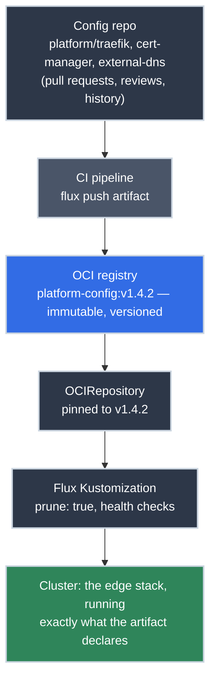

# Deploying Platform Services with Flux and OCI Artifacts

!!! tip "Part of a Learning Path"
    This article is a step in the [Put Your Kubernetes App on the Internet](https://bradpenney.io/pathways/cluster-to-internet) pathway on [bradpenney.io](https://bradpenney.io). It assumes a cluster already running Flux and the delivery model from [Day One](../day_one/overview.md) — [what GitOps is](../day_one/what_is_gitops.md) and [why everything here ships as OCI artifacts](../day_one/your_flux_workflow.md).

The edge stack is written. Sitting in a directory you're proud of are the manifests for [Traefik and its Gateway](https://k8s.bradpenney.io/efficiency/networking/gateway_api/), [cert-manager](https://k8s.bradpenney.io/efficiency/networking/cert_manager/), and [external-dns](https://k8s.bradpenney.io/efficiency/networking/external_dns/) — the machinery that puts apps on the internet. One question left: how does any of it reach the cluster? Your fingers already know the tempting answer, and it's three keystrokes into being wrong.

Because the way you ship this directory decides what kind of platform you run. Apply it by hand and the cluster becomes a snowflake: a pile of state that exists only because someone once typed the right commands in the right order. Ship it the way this article does and the cluster becomes a *consequence*: **if it isn't in the artifact, it doesn't exist**, and everything that is, exists on every cluster that subscribes, forever, with a version number. That one rule is the whole article; every section below is it applied to a different question.

!!! info "What You'll Learn"
    By the end of this article, you'll understand:

    - **The delivery chain**: config repo → CI → versioned OCI artifact → Flux reconciliation, with no hands in the middle
    - **How to structure the platform config repo**, and why the artifact must be self-contained
    - **The two cluster-side resources**: an `OCIRepository` pinned to an exact version, and a `Kustomization` with `prune` on
    - **What happens to manual changes**, and why the reconciler eating your hotfix is a feature
    - **How promotion works**: publishing a version and deploying it are two different, deliberate acts

---



---

## The Rule, and the Chain That Enforces It

[Day One](../day_one/what_is_gitops.md) established the paradigm: the cluster continuously reconciles itself to a declared desired state, and [that state travels as an OCI artifact](../day_one/your_flux_workflow.md): an immutable, versioned bundle in a container registry, not a Git branch some controller polls. This article is the platform engineer's side of that story: *you're the one who builds the artifact.*

The chain has four links, and a human hand touches exactly one of them:

1. **The config repo**: where manifests live, change by pull request, and carry history. *(The one place hands belong.)*
2. **CI packages the repo into an OCI artifact**: a build step declared in the pipeline, producing `platform-config:v1.4.2` in your registry.
3. **An `OCIRepository`** in the cluster points at that artifact, pinned to a version.
4. **A `Kustomization`** applies what's inside, on an interval, forever, and removes what's no longer there.

Nothing in the chain is a command someone runs. Everything is a declaration something reconciles. That's the standard — not because typing is beneath you, but because typed state can't be reviewed, versioned, rolled back, or rebuilt.

## The Config Repo: What Goes in the Artifact

Platform services get a directory each, composed by one Kustomize entry point:

```text title="platform-config repository layout"
platform/
├── kustomization.yaml        # composes everything below
├── traefik/
│   ├── kustomization.yaml    # the directory from the Gateway API article
│   ├── gateway-api-crds.yaml # vendored — see below
│   ├── rbac.yaml
│   ├── deployment.yaml
│   ├── service.yaml
│   └── gatewayclass.yaml
├── cert-manager/
│   ├── kustomization.yaml
│   ├── cert-manager-crds.yaml
│   ├── cert-manager.yaml     # vendored upstream manifests, version-pinned
│   │                         # (--enable-gateway-api arg added to the controller Deployment)
│   └── cluster-issuers.yaml
└── external-dns/
    ├── kustomization.yaml
    ├── rbac.yaml
    └── deployment.yaml       # the flags: sources, provider, txt-owner-id, policy
```

```yaml title="platform/kustomization.yaml" linenums="1"
apiVersion: kustomize.config.k8s.io/v1beta1
kind: Kustomization
resources:
  - traefik  # (1)!
  - cert-manager
  - external-dns
```

1. Each component keeps its own `kustomization.yaml`, so it can be reviewed, versioned, and (when you grow into it) reconciled independently.

Two decisions in that layout carry the rule:

- **Everything upstream is vendored.** The Gateway API CRDs, cert-manager's manifests: copied into the repo at a pinned version, not fetched from the internet at build or deploy time. The artifact must be **self-contained**: a bundle that deploys identically whether the cluster has internet egress or not, this year or next. Upgrading a dependency is a pull request that changes vendored files — visible, reviewable, revertible.
- **No secrets. Ever.** The Cloudflare token external-dns needs, the ACME account key: none of it goes in the artifact. Secrets reach the cluster through their own controlled channel (External Secrets Operator syncing from a secret manager, a topic of its own); the artifact references Secret *names* and stays safe to store, copy, and audit.

## Packaging: A Version Number for Your Platform

CI turns the repo into an artifact — one step in the pipeline definition, declared like everything else:

```yaml title="The packaging step (in your CI pipeline definition)" linenums="1"
flux push artifact \
  oci://registry.example.com/platform/platform-config:v1.4.2 \  # (1)!
  --path=./platform \
  --source="$CI_REPOSITORY_URL" \
  --revision="$CI_COMMIT_SHA"  # (2)!
```

1. A **semver tag**, minted by the pipeline on merge. Artifacts are immutable: `v1.4.2` means the same bytes today, next month, and during the incident review.
2. The artifact carries its provenance — which repo, which commit — as metadata. Every running cluster can answer "where did this config come from?" precisely.

That tag is the unit everything else operates on. Not "the latest state of main": a **number** you can pin, promote, diff, and roll back to.

## The Cluster Side: Two Small Resources

The cluster subscribes with the pair you learned to *read* in [Flux Resources Explained](../day_one/flux_resources.md) — now you're *writing* them:

```yaml title="platform-sync.yaml" linenums="1"
apiVersion: source.toolkit.fluxcd.io/v1
kind: OCIRepository
metadata:
  name: platform-config
  namespace: flux-system
spec:
  interval: 5m
  url: oci://registry.example.com/platform/platform-config
  ref:
    tag: v1.4.2  # (1)!
---
apiVersion: kustomize.toolkit.fluxcd.io/v1
kind: Kustomization
metadata:
  name: platform
  namespace: flux-system
spec:
  interval: 10m
  sourceRef:
    kind: OCIRepository
    name: platform-config
  path: ./  # (2)!
  prune: true  # (3)!
  wait: true
  timeout: 5m  # (4)!
```

1. **Production pins an exact version.** Semver *ranges* exist (`semver: ">=1.4.0 <2.0.0"`) and have a place in dev clusters that always track newest, but a production cluster states exactly what it runs, and changing this line *is* the deploy: one reviewable diff.
2. Where in the artifact to build from — here, its root (the `platform/` content we pushed).
3. `prune: true` is the rule with teeth: remove a manifest from the artifact and the reconciler removes the object from the cluster. The artifact isn't a suggestion; it's an allow-list of what may exist, the same [zero-trust shape](https://k8s.bradpenney.io/efficiency/networking/gateway_api/) as the rest of the platform.
4. `wait` + `timeout` make the Kustomization report **health**, not just "applied": if Traefik's Deployment never goes Ready, the reconciliation fails loudly, where you'll see it in `flux get kustomizations`. The [status-reading skills](../day_one/reading_flux_status.md) from Day One apply unchanged.

And these two resources? They're not hand-applied either: they live in the cluster's own bootstrap configuration, which is itself in Git. It's declarations all the way down; the only imperative act in the whole system is `git merge`.

## The Reconciler Ate My Hotfix (Good.)

Here's the moment the rule stops being philosophy. Someone `kubectl edit`s the Traefik Deployment at 11pm, bumps a resource limit, fixes the incident, goes to bed. By 11:10 the change is **gone**: the reconciler compared the cluster against `v1.4.2`, found drift, and put it back.

That's not the tooling being obstinate; that's the system keeping its one promise: *the cluster runs what the artifact declares.* A hotfix that lives only in cluster state is a time bomb: invisible to review, absent from the next rebuild, contradicting every mental model built on the repo. The correct 11pm move is the same as the 11am move: change the manifest, merge, let the pipeline mint `v1.4.3`, bump the tag. In a genuine break-glass emergency, do what you must — then commit the equivalent change *immediately*, because the reconciler's memory is longer than yours.

`kubectl apply` still has a home: **experimentation**. A kind cluster, a scratch [namespace](https://k8s.bradpenney.io/essentials/namespaces/), a "does this even work" afternoon: apply freely, learn fast, throw it away. The line is bright: experiments are applied by hand; *platforms are reconciled from artifacts.*

One more distinction the versioned artifact makes possible: **publishing and deploying are different acts.** Merging your change and letting CI push `v1.4.3` *publishes*: nothing anywhere is running it yet. Bumping a cluster's pinned tag *deploys*: a separate, deliberate, owned decision. In regulated environments those two acts belong to different roles; even solo, keeping them distinct is what makes "what's actually in prod?" a question with an exact answer.

## Why This Matters for Platform Work

- **Cluster number two is a re-run, not a rebuild.** DR site, staging, a replacement after a bad day: install Flux, apply the bootstrap config, and the entire edge stack reconverges from the artifact. Anything that would be lost in that rebuild was, by definition, drift you're better off without.
- **Rollback is a one-line diff.** `v1.4.3` broke routing? Change the pinned tag back to `v1.4.2` and merge. No archaeology, no remembered commands, no "who knows how this was installed."
- **The audit trail is complete and boring.** What changed = git log. What's deployed where = each cluster's pinned tag. What was running during the incident = an immutable artifact you can pull and inspect byte-for-byte.

## Common Pitfalls

=== ":material-tag-off: Pushed v1.4.3, nothing changed"

    Working as designed: the cluster is **pinned to `v1.4.2`**, and publishing a new artifact deploys nothing. Promotion is the deliberate act of changing the pinned tag in the cluster's config and merging. If you *wanted* auto-tracking (a dev cluster), that's what a semver range on the `OCIRepository` is for — an explicit choice, never the production default.

=== ":material-delete-alert: Prune deleted something I needed"

    Then it wasn't in the artifact, which means it existed only as cluster state: hand-applied, or left over from an earlier version. The recovery is never "re-apply it by hand" (prune will eat it again, correctly); it's adding the manifest to the config repo so it becomes real. Treat every prune surprise as the system *finding* undeclared state for you.

=== ":material-heart-off: The Kustomization is failing health checks"

    `flux get kustomizations` shows `Ready: False` after a version bump. `wait: true` means "applied" isn't good enough; something (say, the new Traefik image) never went Ready. The [Day One diagnosis chain](../day_one/reading_flux_status.md) applies: source first (is the artifact fetchable at that tag?), then the Kustomization's events, then the workload it's waiting on. Roll back by reverting the tag while you investigate: that's one diff, not an outage-length debugging session.

## Practice Exercises

??? question "Exercise 1: The Friday Rollback"

    The `v1.5.0` artifact shipped a Traefik flag typo; routing is degraded in production. Walk the exact rollback: what changes, where, and what do you explicitly *not* do?

    ??? tip "Solution"

        One diff: in the cluster's config, change the `OCIRepository`'s `ref.tag` from `v1.5.0` back to `v1.4.2` (the last known-good version) and merge. Flux fetches the old artifact — immutable, byte-identical to what ran yesterday — and reconciles the cluster back to it, prune and health checks included. What you don't do: `kubectl edit` the Deployment to fix the flag (drift, reverted in minutes, invisible forever), re-push a "fixed" artifact under the *same* `v1.5.0` tag (tags are immutable promises; the fix is `v1.5.1`), or debug live under pressure when a one-line revert restores service first.

??? question "Exercise 2: The Rebuild Test"

    Your cluster is unrecoverable — storage gone, control plane toast. You provision a fresh one. List everything required to get the full edge stack back, and name what this test *proves* about the rule.

    ??? tip "Solution"

        Three things: a cluster running Flux, the bootstrap config (the `OCIRepository` + `Kustomization` pair, itself in Git), and network reach to the registry holding `platform-config:v1.4.2`. That's the complete list: Traefik, its GatewayClass and Gateway, cert-manager and its issuers, external-dns and its ownership stamps all reconverge without a human recalling a single step. The test proves the rule by contrapositive: anything that *doesn't* come back was never in the artifact, hand-applied state the old cluster was silently depending on. A platform that fears this test has drift; a platform built this way treats it as a routine drill.

??? question "Exercise 3: Publish vs. Deploy"

    You merge a change adding a new `--domain-filter` to external-dns. CI mints `platform-config:v1.5.0`. Ten minutes later a teammate asks, "is that live in prod?" Walk the precise answer, and explain why the gap between the two acts is a feature.

    ??? tip "Solution"

        The answer is a lookup, not a guess: check prod's pinned tag. `v1.5.0` existing in the registry means the change is **published**: reviewable, pullable, running nowhere. It's **deployed** only when someone changes prod's `OCIRepository` to `ref.tag: v1.5.0` and merges that. The gap is where deliberateness lives: staging can run `v1.5.0` for a day first, or the prod bump can wait for a change window, a second set of eyes, or a different role entirely (in regulated shops, the person who writes the change and the person who promotes it to prod are deliberately not the same person). Collapsing publish-and-deploy into one act is how "it just went straight to prod" stories start.

## Quick Recap

| Concept | What to Know |
|---------|-------------|
| **The rule** | If it isn't in the artifact, it doesn't exist, and prune enforces it |
| **The chain** | Config repo → CI → OCI artifact → `OCIRepository` → `Kustomization` → cluster |
| **Self-contained artifacts** | Vendor upstream CRDs/manifests at pinned versions; never fetch at deploy time |
| **No secrets in artifacts** | Credentials arrive via their own channel (External Secrets Operator); artifacts reference names |
| **Exact pins in prod** | `ref.tag: v1.4.2`; changing that line *is* the deploy; ranges are for dev at most |
| **`prune` + `wait`** | The artifact is an allow-list of what may exist; health, not just "applied" |
| **Drift** | Reverted on the next reconcile; the feature that keeps cluster and repo truthful |
| **Publish ≠ deploy** | CI minting a version and a cluster adopting it are separate, deliberate acts |
| **Imperative commands** | Experimentation only — platforms are reconciled, never typed |

---

## What's Next?

The pathway's edge stack now ships itself: [the front door](https://k8s.bradpenney.io/efficiency/networking/gateway_api/), [its certificates](https://k8s.bradpenney.io/efficiency/networking/cert_manager/), and [its DNS records](https://k8s.bradpenney.io/efficiency/networking/external_dns/) all reconciled from one versioned artifact, with `git merge` as the only imperative act left in the system. If the Flux resources here felt like review, [Day One](../day_one/overview.md) walks their anatomy; from here, this site goes deeper into running Flux itself as a platform.

## Further Reading

### Official Documentation

- [Flux: OCIRepository](https://fluxcd.io/flux/components/source/ocirepositories/) - The source resource, including tag pinning and semver ranges
- [Flux: Kustomization](https://fluxcd.io/flux/components/kustomize/kustomizations/) - Prune, wait, health checks, and dependency ordering
- [Flux: OCI artifacts cheatsheet](https://fluxcd.io/flux/cheatsheets/oci-artifacts/) - `flux push artifact` and friends

### Related Articles

- [Your Flux Workflow](../day_one/your_flux_workflow.md) - Why delivery runs on OCI artifacts, from the developer's seat
- [Flux Resources Explained](../day_one/flux_resources.md) - The anatomy of the resources this article writes
- [Reading Flux Status](../day_one/reading_flux_status.md) - The diagnosis chain when reconciliation goes sideways

### On the Kubernetes Site

- [Gateway API with Traefik (k8s.bradpenney.io)](https://k8s.bradpenney.io/efficiency/networking/gateway_api/) - The `platform/traefik` directory this artifact delivers
- [Pointing Your Domain at the Cluster (k8s.bradpenney.io)](https://k8s.bradpenney.io/efficiency/networking/external_dns/) - The external-dns flags declared in `platform/external-dns`
